Agent teams combine specialists to tackle complex tasks collaboratively.

```mermaid
graph LR
    subgraph "Agent Team"
        T[📋 Task] --> R[🔍 Researcher]
        R --> W[✍️ Writer]
        W --> E[📝 Editor]
        E --> O[✅ Output]
    end
    
    classDef task fill:#6366F1,stroke:#7C90A0,color:#fff
    classDef agent fill:#F59E0B,stroke:#7C90A0,color:#fff
    classDef output fill:#10B981,stroke:#7C90A0,color:#fff
    
    class T task
    class R,W,E agent
    class O output
```



## Quick Start

<Steps>
<Step title="Create Specialist Agents">
```rust
use praisonai::Agent;

let researcher = Agent::new()
    .name("Researcher")
    .instructions("Research topics thoroughly")
    .build()?;

let writer = Agent::new()
    .name("Writer")
    .instructions("Write clear, engaging content")
    .build()?;
```
</Step>

<Step title="Form a Team">
```rust
use praisonai::AgentTeam;

let team = AgentTeam::new()
    .agent(researcher)
    .agent(writer)
    .build();

let result = team.run("Write an article about AI").await?;
```
</Step>
</Steps>

---

## Team Processes

Choose how agents collaborate:

```mermaid
graph TB
    subgraph "Processes"
        S[Sequential] --> |One after another| O1[A → B → C]
        P[Parallel] --> |All at once| O2[A + B + C]
        H[Hierarchical] --> |Manager delegates| O3[Manager → Workers]
    end
    
    classDef process fill:#6366F1,stroke:#7C90A0,color:#fff
    classDef flow fill:#10B981,stroke:#7C90A0,color:#fff
    
    class S,P,H process
    class O1,O2,O3 flow
```



| Process | Best For |
|---------|----------|
| `Sequential` | Step-by-step workflows |
| `Parallel` | Independent tasks |
| `Hierarchical` | Complex delegated work |

### Sequential Process

```rust
use praisonai::{AgentTeam, Process};

let team = AgentTeam::new()
    .agent(researcher)
    .agent(writer)
    .agent(editor)
    .process(Process::Sequential)
    .build();

// Researcher → Writer → Editor
```

### Parallel Process

```rust
use praisonai::{AgentTeam, Process};

let team = AgentTeam::new()
    .agent(researcher)
    .agent(fact_checker)
    .process(Process::Parallel)
    .build();

// Researcher + Fact Checker run simultaneously
```

### Hierarchical Process

```rust
use praisonai::{AgentTeam, Process};

let team = AgentTeam::new()
    .agent(manager)
    .agent(worker1)
    .agent(worker2)
    .process(Process::Hierarchical)
    .build();

// Manager delegates to workers
```

---

## Configuration

| Option | Type | Default | Description |
|--------|------|---------|-------------|
| `process` | `Process` | `Sequential` | How agents collaborate |
| `verbose` | `bool` | `false` | Show detailed output |

---

## Best Practices

<AccordionGroup>
  <Accordion title="Give each agent a clear role">
    Specialists outperform generalists in teams.
  </Accordion>
  
  <Accordion title="Use sequential for dependent tasks">
    When agent B needs agent A's output, use sequential.
  </Accordion>
  
  <Accordion title="Use parallel for independent tasks">
    Speed up by running independent agents simultaneously.
  </Accordion>
</AccordionGroup>

---

## Related

<CardGroup cols={2}>
  <Card title="Agent" icon="robot" href="/docs/rust/agent">
    Create agents
  </Card>
  <Card title="Handoffs" icon="arrow-right-arrow-left" href="/docs/rust/handoffs">
    Agent delegation
  </Card>
</CardGroup>
