Enable direct communication between agents.

```mermaid
graph LR
    subgraph "Agent-to-Agent"
        A1[🤖 Agent A] --> M[💬 Message]
        M --> A2[🤖 Agent B]
        A2 --> R[📤 Response]
        R --> A1
    end
    
    classDef agent fill:#6366F1,stroke:#7C90A0,color:#fff
    classDef message fill:#F59E0B,stroke:#7C90A0,color:#fff
    
    class A1,A2 agent
    class M,R message
```



## Quick Start

<Steps>
<Step title="Connect Agents">
```rust
use praisonai::{Agent, AgentTeam};

let researcher = Agent::new()
    .name("Researcher")
    .build()?;

let writer = Agent::new()
    .name("Writer")
    .can_call(&researcher)  // Writer can call Researcher
    .build()?;

writer.chat("Write about AI, research first").await?;
// Writer automatically consults Researcher
```
</Step>
</Steps>

---

## Related

<CardGroup cols={2}>
  <Card title="A2A Protocol" icon="arrows-left-right" href="/docs/rust/a2a">
    A2A protocol
  </Card>
  <Card title="Handoffs" icon="arrow-right-arrow-left" href="/docs/rust/handoffs">
    Agent delegation
  </Card>
</CardGroup>
