Build interactive UIs for your agents.

```mermaid
graph LR
    subgraph "Agent UI"
        U[👤 User] --> I[🖥️ Interface]
        I --> A[🤖 Agent]
        A --> O[📤 Output]
        O --> I
    end
    
    classDef user fill:#6366F1,stroke:#7C90A0,color:#fff
    classDef ui fill:#F59E0B,stroke:#7C90A0,color:#fff
    classDef output fill:#10B981,stroke:#7C90A0,color:#fff
    
    class U user
    class I,A ui
    class O output
```



## Quick Start

<Steps>
<Step title="Web UI">
```rust
use praisonai::{Agent, WebUI};

let agent = Agent::new()
    .name("Assistant")
    .build()?;

// Start web interface
WebUI::new(agent)
    .port(8080)
    .start()
    .await?;

// Access at http://localhost:8080
```
</Step>
</Steps>

---

## UI Options

| Type | Description |
|------|-------------|
| Web UI | Browser-based chat |
| CLI | Terminal interface |
| API | REST/WebSocket endpoints |

---

## Related

<CardGroup cols={2}>
  <Card title="Streaming" icon="stream" href="/docs/rust/streaming">
    Real-time updates
  </Card>
  <Card title="Bots" icon="message-bot" href="/docs/rust/bots">
    Platform deployment
  </Card>
</CardGroup>
