Agent is the core execution unit in PraisonAI Rust SDK.

```mermaid
graph LR
    subgraph "Agent"
        A[📝 Prompt] --> B[🧠 LLM]
        B --> C{🔧 Tools?}
        C -->|Yes| D[Execute Tool]
        D --> B
        C -->|No| E[✅ Response]
    end
    
    classDef input fill:#6366F1,stroke:#7C90A0,color:#fff
    classDef process fill:#F59E0B,stroke:#7C90A0,color:#fff
    classDef output fill:#10B981,stroke:#7C90A0,color:#fff
    
    class A input
    class B,C,D process
    class E output
```



## Quick Start

<Steps>

<Step title="Simple Agent">
```rust
use praisonai::Agent;

let agent = Agent::simple("Be helpful")?;
let response = agent.chat("Hello!").await?;
```
</Step>

<Step title="With Builder">
```rust
use praisonai::Agent;

let agent = Agent::new()
    .name("assistant")
    .instructions("You are a helpful AI assistant")
    .build()?;

let response = agent.chat("What is Rust?").await?;
```
</Step>

</Steps>

---

## API Methods

### Agent::simple()

One-liner agent creation:

```rust
// Equivalent to Agent::new().instructions(...).build()
let agent = Agent::simple("You are a helpful assistant")?;
```

### Agent::new()

Start builder for full customization:

```rust
let agent = Agent::new()
    .name("researcher")
    .instructions("Research topics thoroughly")
    .build()?;
```

### agent.chat()

Main method for interaction:

```rust
let response = agent.chat("Your prompt here").await?;
```

### agent.start() / agent.run()

Aliases for `chat()`:

```rust
let response = agent.start("Your task").await?;
let response = agent.run("Your task").await?;
```

---

## Builder Methods

| Method | Type | Description |
|--------|------|-------------|
| `.name(str)` | `&str` | Agent identifier |
| `.instructions(str)` | `&str` | System instructions |
| `.tool(fn)` | `impl Tool` | Add a tool |
| `.build()` | - | Create the Agent |

---

## Complete Example

```rust
use praisonai::{Agent, tool};

#[tool(description = "Search the web")]
async fn search(query: String) -> String {
    format!("Results for: {}", query)
}

#[tokio::main]
async fn main() -> anyhow::Result<()> {
    let agent = Agent::new()
        .name("researcher")
        .instructions("Use search to find information")
        .tool(search)
        .build()?;
    
    // Multiple interactions
    let r1 = agent.chat("Find info about Rust").await?;
    let r2 = agent.chat("Now find info about Python").await?;
    
    // Memory is preserved between chats
    println!("Response 1: {}", r1);
    println!("Response 2: {}", r2);
    
    Ok(())
}
```

---

## Memory

Conversation history is automatically maintained:

```rust
let agent = Agent::simple("Remember our conversation")?;

agent.chat("My name is Alice").await?;
let response = agent.chat("What's my name?").await?;
// Response will include "Alice"

// Clear memory if needed
agent.clear_memory().await?;
```

---

## Best Practices

<AccordionGroup>
  <Accordion title="Use descriptive instructions">
    Clear instructions lead to better agent behavior. Be specific about the agent's role and capabilities.
  </Accordion>
  
  <Accordion title="Add tools for external actions">
    Give agents tools when they need to perform actions beyond text generation.
  </Accordion>
  
  <Accordion title="Handle errors gracefully">
    Always use `?` or proper error handling for async operations.
  </Accordion>
</AccordionGroup>

---

## Related

<CardGroup cols={2}>
  <Card title="Tools" icon="wrench" href="/docs/rust/tools">
    Add capabilities to agents
  </Card>
  <Card title="AgentTeam" icon="users" href="/docs/rust/agent-team">
    Multi-agent coordination
  </Card>
</CardGroup>
