Agents are the primary execution unit in PraisonAI. They combine LLM providers, tools, and memory for autonomous task execution.

```mermaid
graph LR
    subgraph "Agent Architecture"
        A[📝 Instructions] --> AG[🤖 Agent]
        T[🔧 Tools] --> AG
        M[🧠 Memory] --> AG
        AG --> R[💬 Response]
    end
    
    classDef core fill:#6366F1,stroke:#7C90A0,color:#fff
    classDef input fill:#F59E0B,stroke:#7C90A0,color:#fff
    classDef output fill:#10B981,stroke:#7C90A0,color:#fff
    
    class AG core
    class A,T,M input
    class R output
```



## Quick Start

<Steps>
<Step title="Create a Simple Agent">
```rust
use praisonai::Agent;

let agent = Agent::new()
    .name("Assistant")
    .instructions("You are a helpful AI assistant")
    .build()?;

let response = agent.chat("Hello!").await?;
println!("{}", response);
```
</Step>

<Step title="One-Liner Agent">
```rust
use praisonai::Agent;

// Minimal agent with just instructions
let agent = Agent::simple("You are a helpful assistant")?;
let response = agent.start("Help me understand Rust").await?;
```
</Step>

<Step title="Agent with Tools">
```rust
use praisonai::{Agent, tool};

#[tool]
fn search(query: String) -> String {
    format!("Results for: {}", query)
}

let agent = Agent::new()
    .name("Researcher")
    .instructions("Search for information when asked")
    .tool(search)
    .build()?;

let response = agent.chat("Find info about Rust").await?;
```
</Step>
</Steps>

---

## User Interaction Flow


---

## Agent Struct

```rust
pub struct Agent {
    id: String,
    name: String,
    instructions: String,
    llm: Arc<dyn LlmProvider>,
    tools: Arc<RwLock<ToolRegistry>>,
    memory: Arc<RwLock<Memory>>,
    config: AgentConfig,
}
```

### Runtime Methods

| Method | Signature | Description |
|--------|-----------|-------------|
| `chat(prompt)` | `async fn chat(&self, &str) -> Result<String>` | Main interaction method |
| `start(prompt)` | `async fn start(&self, &str) -> Result<String>` | Alias for chat |
| `run(task)` | `async fn run(&self, &str) -> Result<String>` | Alias for chat |
| `add_tool(tool)` | `async fn add_tool(&self, impl Tool)` | Add tool at runtime |
| `clear_memory()` | `async fn clear_memory(&self) -> Result<()>` | Clear conversation |
| `history()` | `async fn history(&self) -> Result<Vec<Message>>` | Get message history |

### Accessor Methods

| Method | Signature | Description |
|--------|-----------|-------------|
| `id()` | `fn id(&self) -> &str` | Get agent ID |
| `name()` | `fn name(&self) -> &str` | Get agent name |
| `instructions()` | `fn instructions(&self) -> &str` | Get instructions |
| `model()` | `fn model(&self) -> &str` | Get model name |
| `tool_count()` | `async fn tool_count(&self) -> usize` | Number of tools |

---

## AgentBuilder

Fluent API for constructing agents.

### Builder Methods

| Method | Signature | Default | Description |
|--------|-----------|---------|-------------|
| `new()` | `fn new() -> AgentBuilder` | - | Create builder |
| `name(n)` | `fn name(impl Into<String>) -> Self` | `"agent"` | Set name |
| `instructions(i)` | `fn instructions(impl Into<String>) -> Self` | Generic assistant prompt | Set system prompt |
| `model(m)` | `fn model(impl Into<String>) -> Self` | `"gpt-4o-mini"` | Set LLM model |
| `llm(m)` | `fn llm(impl Into<String>) -> Self` | - | Alias for model |
| `api_key(k)` | `fn api_key(impl Into<String>) -> Self` | From ENV | Set API key |
| `base_url(u)` | `fn base_url(impl Into<String>) -> Self` | OpenAI default | Set API endpoint |
| `temperature(t)` | `fn temperature(f32) -> Self` | `0.7` | LLM temperature |
| `max_tokens(n)` | `fn max_tokens(u32) -> Self` | None | Max response tokens |
| `tool(t)` | `fn tool(impl Tool) -> Self` | - | Add a tool |
| `tools(ts)` | `fn tools(impl IntoIterator) -> Self` | - | Add multiple tools |
| `memory(b)` | `fn memory(bool) -> Self` | `true` | Enable/disable memory |
| `max_iterations(n)` | `fn max_iterations(usize) -> Self` | `10` | Max tool call loops |
| `verbose(b)` | `fn verbose(bool) -> Self` | `false` | Enable logging |
| `stream(b)` | `fn stream(bool) -> Self` | `true` | Enable streaming |
| `build()` | `fn build(self) -> Result<Agent>` | - | Build agent |

---

## Configuration Options

### AgentConfig

| Option | Type | Default | Description |
|--------|------|---------|-------------|
| `max_iterations` | `usize` | `10` | Max tool calling iterations |
| `verbose` | `bool` | `false` | Enable verbose output |
| `stream` | `bool` | `true` | Enable response streaming |

---

## Common Patterns

### Research Agent with Multiple Tools

```rust
use praisonai::{Agent, tool};

#[tool]
fn web_search(query: String) -> String {
    format!("Web results for: {}", query)
}

#[tool]
fn calculate(expression: String) -> String {
    format!("Calculated: {}", expression)
}

let researcher = Agent::new()
    .name("Researcher")
    .instructions("You are a research assistant. Use tools to find and analyze information.")
    .model("gpt-4o")
    .tool(web_search)
    .tool(calculate)
    .temperature(0.3)
    .max_iterations(20)
    .build()?;

let result = researcher.chat("Research the population of Tokyo and calculate growth rate").await?;
```

### Conversational Agent with Memory

```rust
use praisonai::Agent;

let assistant = Agent::new()
    .name("Assistant")
    .instructions("You are a friendly assistant. Remember our conversation.")
    .memory(true)
    .build()?;

// Conversation persists across calls
assistant.chat("My name is Alice").await?;
assistant.chat("What's my name?").await?; // Remembers "Alice"
```

---

## Best Practices

<AccordionGroup>
  <Accordion title="Use descriptive instructions">
    Clear instructions lead to better outputs. Include role, capabilities, and constraints.
  </Accordion>
  
  <Accordion title="Set appropriate max_iterations">
    Higher values for complex tool chains, lower for simple tasks.
  </Accordion>
  
  <Accordion title="Use streaming for long responses">
    Keep `stream(true)` for better user experience with long outputs.
  </Accordion>
  
  <Accordion title="Handle errors gracefully">
    All async methods return `Result` - use `?` operator or match.
  </Accordion>
</AccordionGroup>

---

## Related

<CardGroup cols={2}>
  <Card title="Tools" icon="wrench" href="/docs/rust/tools">
    Tool system
  </Card>
  <Card title="Memory" icon="brain" href="/docs/rust/memory">
    Memory management
  </Card>
</CardGroup>
