AGUI provides UI components for building agent-powered graphical interfaces.

```mermaid
graph LR
    subgraph "AGUI Architecture"
        U[👤 User] --> I[🖥️ Interface]
        I --> A[🤖 Agent]
        A --> R[📤 Response]
        R --> I
    end
    
    classDef user fill:#6366F1,stroke:#7C90A0,color:#fff
    classDef ui fill:#F59E0B,stroke:#7C90A0,color:#fff
    classDef agent fill:#10B981,stroke:#7C90A0,color:#fff
    
    class U user
    class I,R ui
    class A agent
```



## Quick Start

<Steps>
<Step title="Create UI Component">
```rust
use praisonai::agui::{ChatWidget, AgentUI};

let widget = ChatWidget::new()
    .title("AI Assistant")
    .placeholder("Ask anything...");

let ui = AgentUI::new()
    .add_widget(widget);
```
</Step>

<Step title="Connect Agent">
```rust
use praisonai::{Agent, agui::AgentUI};

let agent = Agent::new()
    .name("assistant")
    .instructions("You are helpful")
    .build()?;

let ui = AgentUI::new()
    .agent(agent)
    .on_message(|msg| println!("User: {}", msg));

ui.run();
```
</Step>
</Steps>

---

## Configuration Options

```rust
use praisonai::agui::{AgentUI, Theme};

let ui = AgentUI::new()
    .title("My Agent")
    .theme(Theme::Dark)
    .width(800)
    .height(600);
```

| Option | Type | Default | Description |
|--------|------|---------|-------------|
| `title` | `str` | `"Agent"` | Window title |
| `theme` | `Theme` | `Light` | UI theme |
| `width` | `u32` | `800` | Window width |
| `height` | `u32` | `600` | Window height |

---

## Best Practices

<AccordionGroup>
  <Accordion title="Use appropriate themes">
    Match the theme to user preferences with `Theme::System`.
  </Accordion>
  
  <Accordion title="Handle loading states">
    Show loading indicators during agent processing.
  </Accordion>
</AccordionGroup>

---

## Related

<CardGroup cols={2}>
  <Card title="Agent" icon="robot" href="/docs/rust/agent">
    Agent API
  </Card>
  <Card title="Display" icon="desktop" href="/docs/rust/display">
    Display callbacks
  </Card>
</CardGroup>
