AGUI provides a graphical interface for agent configuration and testing.

```mermaid
graph LR
    subgraph "AGUI"
        C[⚙️ Configure] --> T[🧪 Test]
        T --> D[🚀 Deploy]
    end
    
    classDef step fill:#6366F1,stroke:#7C90A0,color:#fff
    class C,T,D step
```



## Quick Start

<Steps>
<Step title="Launch AGUI">
```bash
praisonai gui
```
</Step>

<Step title="Configure Agent">
Use the visual editor to:
- Set name and instructions
- Add tools
- Configure settings
</Step>

<Step title="Test and Export">
Test your agent in the UI, then export the configuration.
</Step>
</Steps>

---

## Related

<CardGroup cols={2}>
  <Card title="Agent UI" icon="window" href="/docs/rust/agent-ui-agui">
    Custom UIs
  </Card>
  <Card title="CLI" icon="terminal" href="/docs/rust/cli">
    Command line
  </Card>
</CardGroup>
