Approval mode requires human confirmation before agents execute sensitive operations.

```mermaid
graph LR
    subgraph "Approval Flow"
        A[🤖 Agent] --> R[❓ Request]
        R --> H[👤 Human]
        H --> |Approve| E[✅ Execute]
        H --> |Deny| S[🛑 Stop]
    end
    
    classDef agent fill:#6366F1,stroke:#7C90A0,color:#fff
    classDef human fill:#F59E0B,stroke:#7C90A0,color:#fff
    classDef result fill:#10B981,stroke:#7C90A0,color:#fff
    classDef stop fill:#EF4444,stroke:#7C90A0,color:#fff
    
    class A agent
    class R,H human
    class E result
    class S stop
```



## Quick Start

<Steps>
<Step title="Enable Approval">
```rust
use praisonai::Agent;

let agent = Agent::new()
    .name("Assistant")
    .require_approval(true)  // Human must approve actions
    .build()?;

agent.chat("Delete old files").await?;
// Agent asks: "May I delete files in /old? (y/n)"
```
</Step>

<Step title="Custom Approval Handler">
```rust
use praisonai::Agent;

let agent = Agent::new()
    .name("Assistant")
    .on_approval(|action, _args| {
        // Custom approval logic
        println!("Approve action: {}? (y/n)", action);
        // Return true to approve, false to deny
        true
    })
    .build()?;
```
</Step>
</Steps>

---

## How It Works


---

## Configuration

| Option | Type | Default | Description |
|--------|------|---------|-------------|
| `require_approval` | `bool` | `false` | Require approval for all |
| `approval_tools` | `Vec<String>` | `[]` | Tools requiring approval |

---

## Best Practices

<AccordionGroup>
  <Accordion title="Use for destructive operations">
    Enable approval for delete, write, and modify operations.
  </Accordion>
  
  <Accordion title="Skip for read-only operations">
    Don't require approval for search, read, or analyze.
  </Accordion>
</AccordionGroup>

---

## Related

<CardGroup cols={2}>
  <Card title="Autonomy" icon="robot" href="/docs/rust/autonomy">
    Autonomy levels
  </Card>
  <Card title="Guardrails" icon="shield" href="/docs/rust/guardrails">
    Safety validation
  </Card>
</CardGroup>
