Approval mode requires human confirmation before agents execute sensitive operations.

```mermaid
graph LR
    subgraph "Approval Flow"
        A[🤖 Agent] --> R[❓ Request]
        R --> H[👤 Human]
        H --> |Approve| E[✅ Execute]
        H --> |Deny| S[🛑 Stop]
    end
    
    classDef agent fill:#6366F1,stroke:#7C90A0,color:#fff
    classDef human fill:#F59E0B,stroke:#7C90A0,color:#fff
    classDef result fill:#10B981,stroke:#7C90A0,color:#fff
    classDef stop fill:#EF4444,stroke:#7C90A0,color:#fff
    
    class A agent
    class R,H human
    class E result
    class S stop
```



## Quick Start

<Steps>
<Step title="Configure Approval with AutonomyConfig">
```rust
use praisonai::AutonomyConfig;

// Create config that requires approval (default)
let config = AutonomyConfig::new();
// require_approval is true by default

// Or disable approval
let no_approval = AutonomyConfig::new()
    .no_approval();

println!("Approval required: {}", config.require_approval);  // true
println!("Approval required: {}", no_approval.require_approval);  // false
```
</Step>

<Step title="Block Dangerous Tools">
```rust
use praisonai::AutonomyConfig;

let config = AutonomyConfig::new()
    .block_tool("delete_file")
    .block_tool("rm_directory")
    .max_actions(10);  // Pause after 10 autonomous actions
```
</Step>

<Step title="Allow Specific Tools">
```rust
use praisonai::{AutonomyConfig, AutonomyLevel};

let config = AutonomyConfig::new()
    .level(AutonomyLevel::Limited)
    .allow_tool("read_file")
    .allow_tool("search")
    .allow_tool("list_dir");
```
</Step>
</Steps>

---

## How It Works


---

## AutonomyConfig

Configuration for agent autonomy and approval behavior.

```rust
pub struct AutonomyConfig {
    pub level: AutonomyLevel,
    pub require_approval: bool,
    pub max_actions: Option<usize>,
    pub allowed_tools: Vec<String>,
    pub blocked_tools: Vec<String>,
}
```

### Methods

| Method | Description |
|--------|-------------|
| `new()` | Create with defaults (approval required) |
| `level(AutonomyLevel)` | Set autonomy level |
| `no_approval()` | Disable approval requirement |
| `max_actions(usize)` | Set max actions before pause |
| `allow_tool(name)` | Add tool to allowed list |
| `block_tool(name)` | Add tool to blocked list |

### Configuration Options

| Option | Type | Default | Description |
|--------|------|---------|-------------|
| `require_approval` | `bool` | `true` | Require approval for actions |
| `level` | `AutonomyLevel` | `Default` | Autonomy level |
| `max_actions` | `Option<usize>` | `None` | Max actions before pause |
| `allowed_tools` | `Vec<String>` | `[]` | Tools allowed autonomously |
| `blocked_tools` | `Vec<String>` | `[]` | Tools never run autonomously |

---

## Best Practices

<AccordionGroup>
  <Accordion title="Use for destructive operations">
    Enable approval for delete, write, and modify operations.
  </Accordion>
  
  <Accordion title="Skip for read-only operations">
    Don't require approval for search, read, or analyze.
  </Accordion>
</AccordionGroup>

---

## Related

<CardGroup cols={2}>
  <Card title="Autonomy" icon="robot" href="/docs/rust/autonomy">
    Autonomy levels
  </Card>
  <Card title="Guardrails" icon="shield" href="/docs/rust/guardrails">
    Safety validation
  </Card>
</CardGroup>
