Approval enables human-in-the-loop validation before agents execute sensitive actions.

```mermaid
graph LR
    subgraph "Approval Flow"
        A[🤖 Agent] --> R[📋 Request]
        R --> H[👤 Human]
        H -->|Approve| E[✅ Execute]
        H -->|Reject| D[❌ Deny]
    end
    
    classDef agent fill:#6366F1,stroke:#7C90A0,color:#fff
    classDef request fill:#F59E0B,stroke:#7C90A0,color:#fff
    classDef result fill:#10B981,stroke:#7C90A0,color:#fff
    
    class A agent
    class R,H request
    class E,D result
```



## Quick Start

<Steps>
<Step title="Enable Approval">
```rust
use praisonai::Agent;

let agent = Agent::new()
    .name("assistant")
    .require_approval(true)
    .build()?;
```
</Step>

<Step title="Custom Approval Handler">
```rust
use praisonai::{Agent, approval::ApprovalHandler};

let agent = Agent::new()
    .name("assistant")
    .on_approval(|request| {
        println!("Approve: {}?", request.action);
        // Return true to approve, false to reject
        true
    })
    .build()?;
```
</Step>
</Steps>

---

## Configuration Options

```rust
use praisonai::approval::ApprovalConfig;

let config = ApprovalConfig::new()
    .require_for_tools(true)
    .require_for_handoffs(true)
    .auto_approve_safe(true);
```

| Option | Type | Default | Description |
|--------|------|---------|-------------|
| `require_for_tools` | `bool` | `false` | Approve tool calls |
| `require_for_handoffs` | `bool` | `false` | Approve handoffs |
| `auto_approve_safe` | `bool` | `false` | Skip approval for safe actions |

---

## Best Practices

<AccordionGroup>
  <Accordion title="Require approval for destructive actions">
    Enable approval for file writes, API calls, and data modifications.
  </Accordion>
  
  <Accordion title="Provide clear context">
    Include what the agent wants to do and why in approval requests.
  </Accordion>
</AccordionGroup>

---

## Related

<CardGroup cols={2}>
  <Card title="Autonomy" icon="robot" href="/docs/rust/autonomy">
    Agent autonomy levels
  </Card>
  <Card title="Guardrails" icon="shield" href="/docs/rust/guardrails">
    Input/output guards
  </Card>
</CardGroup>
