Enable voice interactions with speech-to-text and text-to-speech.

```mermaid
graph LR
    subgraph "Audio Flow"
        V[🎤 Voice] --> T[📝 Text]
        T --> A[🤖 Agent]
        A --> S[🔊 Speech]
    end
    
    classDef input fill:#6366F1,stroke:#7C90A0,color:#fff
    classDef agent fill:#F59E0B,stroke:#7C90A0,color:#fff
    classDef output fill:#10B981,stroke:#7C90A0,color:#fff
    
    class V input
    class T,A agent
    class S output
```



## Quick Start

<Steps>
<Step title="Voice Input">
```rust
use praisonai::{Agent, AudioConfig};

let config = AudioConfig::new()
    .speech_to_text(true);

let agent = Agent::new()
    .name("Voice Assistant")
    .audio(config)
    .build()?;

// Agent can process audio input
```
</Step>

<Step title="Voice Output">
```rust
use praisonai::{Agent, AudioConfig};

let config = AudioConfig::new()
    .text_to_speech(true)
    .voice("alloy");

let agent = Agent::new()
    .name("Voice Assistant")
    .audio(config)
    .build()?;

// Agent responds with speech
```
</Step>
</Steps>

---

## Configuration

| Option | Type | Default | Description |
|--------|------|---------|-------------|
| `speech_to_text` | `bool` | `false` | Enable voice input |
| `text_to_speech` | `bool` | `false` | Enable voice output |
| `voice` | `String` | `alloy` | Voice selection |

---

## Related

<CardGroup cols={2}>
  <Card title="Agent" icon="robot" href="/docs/rust/agent">
    Agent configuration
  </Card>
  <Card title="Streaming" icon="stream" href="/docs/rust/streaming">
    Stream audio
  </Card>
</CardGroup>
