Enable voice interaction with AudioAgent for speech-to-text and text-to-speech.

```mermaid
graph LR
    subgraph "Audio Flow"
        I[🎤 Voice] --> A[🤖 AudioAgent]
        A --> L[💬 LLM]
        L --> S[🔊 Speech]
    end
    
    classDef input fill:#6366F1,stroke:#7C90A0,color:#fff
    classDef agent fill:#F59E0B,stroke:#7C90A0,color:#fff
    classDef output fill:#10B981,stroke:#7C90A0,color:#fff
    
    class I input
    class A,L agent
    class S output
```



## Quick Start

<Steps>
<Step title="Create Voice-Enabled Agent">
```rust
use praisonai::{AudioAgent, AudioConfig};

// Configure audio settings
let config = AudioConfig::new()
    .speech_to_text(true)
    .text_to_speech(true)
    .voice("alloy");

// Create AudioAgent (specialized agent with audio capabilities)
let audio_agent = AudioAgent::new()
    .name("Voice Assistant")
    .instructions("You are a helpful voice assistant")
    .config(config)
    .build()?;

// Process audio input
let response = audio_agent.process_audio("path/to/audio.wav").await?;
```
</Step>

<Step title="Text-to-Speech Output">
```rust
use praisonai::{AudioAgent, AudioConfig};

let config = AudioConfig::new()
    .text_to_speech(true)
    .voice("nova");  // Choose voice

let agent = AudioAgent::new()
    .name("Speaker")
    .config(config)
    .build()?;

// Generate speech from text
let audio_bytes = agent.speak("Hello, how can I help?").await?;
```
</Step>
</Steps>

---

## AudioConfig

| Option | Type | Default | Description |
|--------|------|---------|-------------|
| `speech_to_text` | `bool` | `false` | Enable voice input |
| `text_to_speech` | `bool` | `false` | Enable voice output |
| `voice` | `String` | `alloy` | Voice selection |

### Available Voices

| Voice | Style |
|-------|-------|
| `alloy` | Professional, balanced |
| `nova` | Warm, conversational |
| `echo` | Clear, articulate |
| `onyx` | Deep, authoritative |

---

## Related

<CardGroup cols={2}>
  <Card title="Agent" icon="robot" href="/docs/rust/agent">
    Basic agent creation
  </Card>
  <Card title="Streaming" icon="stream" href="/docs/rust/streaming">
    Real-time responses
  </Card>
</CardGroup>
