Audio enables speech-to-text and text-to-speech capabilities for voice-powered agents.

```mermaid
graph LR
    subgraph "Audio Pipeline"
        V[🎤 Voice] --> S[📝 STT]
        S --> A[🤖 Agent]
        A --> T[🔊 TTS]
        T --> O[🔈 Output]
    end
    
    classDef input fill:#6366F1,stroke:#7C90A0,color:#fff
    classDef process fill:#F59E0B,stroke:#7C90A0,color:#fff
    classDef output fill:#10B981,stroke:#7C90A0,color:#fff
    
    class V input
    class S,A,T process
    class O output
```



## Quick Start

<Steps>
<Step title="Enable Audio">
```rust
use praisonai::{Agent, audio::AudioConfig};

let agent = Agent::new()
    .name("voice-agent")
    .audio(AudioConfig::new())
    .build()?;
```
</Step>

<Step title="Speech Processing">
```rust
use praisonai::audio::{transcribe, speak};

// Speech to text
let text = transcribe("recording.wav").await?;
println!("User said: {}", text);

// Text to speech
speak("Hello, how can I help?").await?;
```
</Step>
</Steps>

---

## Configuration Options

```rust
use praisonai::audio::AudioConfig;

let config = AudioConfig::new()
    .stt_model("whisper-1")
    .tts_model("tts-1")
    .voice("alloy");
```

| Option | Type | Default | Description |
|--------|------|---------|-------------|
| `stt_model` | `str` | `"whisper-1"` | Speech-to-text model |
| `tts_model` | `str` | `"tts-1"` | Text-to-speech model |
| `voice` | `str` | `"alloy"` | Voice for TTS |

---

## Best Practices

<AccordionGroup>
  <Accordion title="Handle audio errors gracefully">
    Check for microphone access and handle transcription failures.
  </Accordion>
  
  <Accordion title="Use appropriate voices">
    Select voices that match your application's tone.
  </Accordion>
</AccordionGroup>

---

## Related

<CardGroup cols={2}>
  <Card title="Realtime" icon="bolt" href="/docs/rust/realtime">
    Real-time streaming
  </Card>
  <Card title="Agent" icon="robot" href="/docs/rust/agent">
    Agent API
  </Card>
</CardGroup>
