Auto Generation creates agents automatically based on task descriptions.

```mermaid
graph LR
    subgraph "Auto Generation"
        T[📝 Task] --> G[🪄 Generate]
        G --> A[🤖 Agents]
    end
    
    classDef task fill:#6366F1,stroke:#7C90A0,color:#fff
    classDef generate fill:#F59E0B,stroke:#7C90A0,color:#fff
    classDef agents fill:#10B981,stroke:#7C90A0,color:#fff
    
    class T task
    class G generate
    class A agents
```



## Quick Start

<Steps>
<Step title="Create AutoAgents">
```rust
use praisonai::parity::AutoAgents;

let auto = AutoAgents::new()
    .task("Research and write a report on AI trends")
    .build()?;
```
</Step>

<Step title="Run">
```rust
let result = auto.run().await?;
println!("{}", result);
```
</Step>
</Steps>

---

## AutoAgentsConfig

```rust
pub struct AutoAgentsConfig {
    pub task: String,
    pub max_agents: usize,
    pub verbose: bool,
}
```

| Option | Type | Default | Description |
|--------|------|---------|-------------|
| `task` | `String` | Required | Task description |
| `max_agents` | `usize` | `5` | Maximum agents |
| `verbose` | `bool` | `false` | Verbose output |

---

## AutoRagAgent

```rust
let rag = AutoRagAgent::new()
    .source("docs/")
    .build()?;

let answer = rag.query("What is the main concept?").await?;
```

---

## Best Practices

<AccordionGroup>
  <Accordion title="Be specific in tasks">
    Provide clear, detailed task descriptions.
  </Accordion>
  
  <Accordion title="Limit max_agents">
    Start with fewer agents and increase as needed.
  </Accordion>
</AccordionGroup>

---

## Related

<CardGroup cols={2}>
  <Card title="Agent" icon="robot" href="/docs/rust/agent">
    Agent API
  </Card>
  <Card title="Workflows" icon="sitemap" href="/docs/rust/workflows">
    Workflow patterns
  </Card>
</CardGroup>
