Auto-generate agent configurations from descriptions.

```mermaid
graph LR
    subgraph "Auto Generation"
        D[📝 Description] --> G[⚙️ Generator]
        G --> A[🤖 Agent]
    end
    
    classDef input fill:#6366F1,stroke:#7C90A0,color:#fff
    classDef output fill:#10B981,stroke:#7C90A0,color:#fff
    
    class D input
    class G,A output
```



## Quick Start

<Steps>
<Step title="Generate from Description">
```rust
use praisonai::AutoAgent;

let agent = AutoAgent::generate(
    "A customer support agent that can look up orders and process refunds"
).await?;

// Agent is ready with appropriate tools and instructions
agent.chat("I need to check my order status").await?;
```
</Step>
</Steps>

---

## What Gets Generated

| Component | Generated From |
|-----------|---------------|
| Instructions | Task description |
| Tools | Inferred capabilities |
| Guardrails | Safety requirements |

---

## Related

<CardGroup cols={2}>
  <Card title="Agent" icon="robot" href="/docs/rust/agent">
    Manual configuration
  </Card>
  <Card title="Tools" icon="wrench" href="/docs/rust/tools">
    Add tools
  </Card>
</CardGroup>
