Set autonomy levels to control agent independence - from fully supervised to fully autonomous.

```mermaid
graph LR
    subgraph "Autonomy Levels"
        L[🔒 Low] --> M[⚖️ Medium]
        M --> H[🚀 High]
        H --> F[⚡ Full]
    end
    
    classDef low fill:#EF4444,stroke:#7C90A0,color:#fff
    classDef med fill:#F59E0B,stroke:#7C90A0,color:#fff
    classDef high fill:#10B981,stroke:#7C90A0,color:#fff
    
    class L low
    class M med
    class H,F high
```



## Quick Start

<Steps>
<Step title="Standard Autonomy">
```rust
use praisonai::Agent;

// Default: asks for approval on sensitive actions
let agent = Agent::new()
    .name("Assistant")
    .build()?;
```
</Step>

<Step title="Full Autonomy">
```rust
use praisonai::{Agent, AutonomyConfig};

let config = AutonomyConfig::high();

let agent = Agent::new()
    .name("Autonomous Bot")
    .autonomy(config)
    .build()?;

// Executes without asking for approval
```
</Step>
</Steps>

---

## Choosing Autonomy Level


| Level | Behavior |
|-------|----------|
| `low` | Asks approval for every action |
| `medium` | Asks for sensitive actions only |
| `high` | Operates independently |
| `full` | No restrictions |

---

## Configuration

| Option | Type | Default | Description |
|--------|------|---------|-------------|
| `level` | `String` | `medium` | Autonomy level |
| `require_approval` | `bool` | Varies | Require human approval |
| `allowed_tools` | `Vec<String>` | All | Allowed tools |
| `blocked_tools` | `Vec<String>` | None | Blocked tools |

---

## Best Practices

<AccordionGroup>
  <Accordion title="Start with medium autonomy">
    Balance between productivity and safety. Upgrade when comfortable.
  </Accordion>
  
  <Accordion title="Use low for testing">
    While developing, use low autonomy to catch issues early.
  </Accordion>
  
  <Accordion title="Block dangerous tools explicitly">
    For high autonomy agents, explicitly block tools that could cause harm.
  </Accordion>
</AccordionGroup>

---

## Related

<CardGroup cols={2}>
  <Card title="Execution" icon="play" href="/docs/rust/execution">
    Execution limits
  </Card>
  <Card title="Guardrails" icon="shield" href="/docs/rust/guardrails">
    Safety validation
  </Card>
</CardGroup>
