Set autonomy levels to control agent independence - from fully supervised to fully autonomous.

```mermaid
graph LR
    subgraph "Autonomy Levels"
        L[🔒 Low] --> M[⚖️ Medium]
        M --> H[🚀 High]
        H --> F[⚡ Full]
    end
    
    classDef low fill:#EF4444,stroke:#7C90A0,color:#fff
    classDef med fill:#F59E0B,stroke:#7C90A0,color:#fff
    classDef high fill:#10B981,stroke:#7C90A0,color:#fff
    
    class L low
    class M med
    class H,F high
```



## Quick Start

<Steps>
<Step title="Configure Autonomy">
```rust
use praisonai::{AutonomyConfig, AutonomyLevel};

// Create autonomy configuration
let config = AutonomyConfig::new()
    .level(AutonomyLevel::Suggest);  // Default - suggests actions, waits for approval

println!("Level: {:?}", config.level);
println!("Requires approval: {}", config.require_approval);
```
</Step>

<Step title="Full Autonomy">
```rust
use praisonai::{AutonomyConfig, AutonomyLevel};

let config = AutonomyConfig::new()
    .level(AutonomyLevel::FullAuto)  // Autonomous operation
    .no_approval()                    // Skip approval prompts
    .max_actions(20);                 // Limit actions per session
```
</Step>

<Step title="Limited Autonomy with Tool Restrictions">
```rust
use praisonai::{AutonomyConfig, AutonomyLevel};

let config = AutonomyConfig::new()
    .level(AutonomyLevel::AutoEdit)
    .allow_tool("read_file")
    .allow_tool("search")
    .block_tool("delete_file")
    .block_tool("execute_command");
```
</Step>
</Steps>

---

## Choosing Autonomy Level


| Level | Enum | Behavior |
|-------|------|----------|
| Suggest | `AutonomyLevel::Suggest` | Suggests actions, waits for user approval |
| Auto Edit | `AutonomyLevel::AutoEdit` | Auto-edits with confirmation |
| Full Auto | `AutonomyLevel::FullAuto` | Full autonomous operation |

---

## AutonomyConfig

Configuration for agent autonomy behavior.

```rust
pub struct AutonomyConfig {
    pub level: AutonomyLevel,
    pub require_approval: bool,
    pub max_actions: Option<usize>,
    pub allowed_tools: Vec<String>,
    pub blocked_tools: Vec<String>,
}
```

### Methods

| Method | Description |
|--------|-------------|
| `new()` | Create with defaults |
| `level(AutonomyLevel)` | Set autonomy level |
| `no_approval()` | Disable approval requirement |
| `max_actions(usize)` | Set max actions before pause |
| `allow_tool(name)` | Allow specific tool |
| `block_tool(name)` | Block specific tool |
| `full` | No restrictions |

---

## Configuration

| Option | Type | Default | Description |
|--------|------|---------|-------------|
| `level` | `String` | `medium` | Autonomy level |
| `require_approval` | `bool` | Varies | Require human approval |
| `allowed_tools` | `Vec<String>` | All | Allowed tools |
| `blocked_tools` | `Vec<String>` | None | Blocked tools |

---

## Best Practices

<AccordionGroup>
  <Accordion title="Start with medium autonomy">
    Balance between productivity and safety. Upgrade when comfortable.
  </Accordion>
  
  <Accordion title="Use low for testing">
    While developing, use low autonomy to catch issues early.
  </Accordion>
  
  <Accordion title="Block dangerous tools explicitly">
    For high autonomy agents, explicitly block tools that could cause harm.
  </Accordion>
</AccordionGroup>

---

## Related

<CardGroup cols={2}>
  <Card title="Execution" icon="play" href="/docs/rust/execution">
    Execution limits
  </Card>
  <Card title="Guardrails" icon="shield" href="/docs/rust/guardrails">
    Safety validation
  </Card>
</CardGroup>
