Autonomy controls how independently agents can act without human intervention.

```mermaid
graph TB
    subgraph "Autonomy Levels"
        direction LR
        L1[🔒 Low] --> L2[⚖️ Medium] --> L3[🚀 High]
    end
    
    L1 --> |"Approval required"| A1[Every action]
    L2 --> |"Approval required"| A2[Risky actions]
    L3 --> |"Approval required"| A3[None]
    
    classDef level fill:#6366F1,stroke:#7C90A0,color:#fff
    classDef action fill:#F59E0B,stroke:#7C90A0,color:#fff
    
    class L1,L2,L3 level
    class A1,A2,A3 action
```



## Quick Start

<Steps>
<Step title="Set Autonomy Level">
```rust
use praisonai::{Agent, AutonomyLevel};

let agent = Agent::new()
    .name("worker")
    .autonomy(AutonomyLevel::Medium)
    .build()?;
```
</Step>

<Step title="Custom Autonomy">
```rust
use praisonai::autonomy::AutonomyConfig;

let agent = Agent::new()
    .autonomy(AutonomyConfig::new()
        .level(AutonomyLevel::High)
        .max_iterations(10)
        .allow_tool_calls(true))
    .build()?;
```
</Step>
</Steps>

---

## Configuration Options

| Level | Description | Approval Required |
|-------|-------------|-------------------|
| `Low` | Minimal autonomy | Every action |
| `Medium` | Balanced autonomy | Risky actions only |
| `High` | Full autonomy | No approval needed |

```rust
use praisonai::autonomy::AutonomyConfig;

let config = AutonomyConfig::new()
    .level(AutonomyLevel::Medium)
    .max_iterations(5)
    .allow_tool_calls(true)
    .allow_handoffs(false);
```

| Option | Type | Default | Description |
|--------|------|---------|-------------|
| `level` | `AutonomyLevel` | `Medium` | Autonomy level |
| `max_iterations` | `usize` | `10` | Max autonomous loops |
| `allow_tool_calls` | `bool` | `true` | Can use tools |
| `allow_handoffs` | `bool` | `true` | Can hand off |

---

## Best Practices

<AccordionGroup>
  <Accordion title="Start with low autonomy">
    Begin with low autonomy and increase as you gain confidence in the agent.
  </Accordion>
  
  <Accordion title="Set iteration limits">
    Always set `max_iterations` to prevent runaway loops.
  </Accordion>
</AccordionGroup>

---

## Related

<CardGroup cols={2}>
  <Card title="Approval" icon="check-double" href="/docs/rust/approval">
    Approval workflows
  </Card>
  <Card title="Guardrails" icon="shield" href="/docs/rust/guardrails">
    Safety guards
  </Card>
</CardGroup>
