Deploy your agents as chat bots on various platforms.

```mermaid
graph LR
    subgraph "Bot Deployment"
        A[🤖 Agent] --> B[🤖 Bot]
        B --> S[Slack]
        B --> D[Discord]
        B --> T[Telegram]
    end
    
    classDef agent fill:#6366F1,stroke:#7C90A0,color:#fff
    classDef platform fill:#10B981,stroke:#7C90A0,color:#fff
    
    class A,B agent
    class S,D,T platform
```



## Quick Start

<Steps>
<Step title="Create Bot Agent">
```rust
use praisonai::Agent;

let agent = Agent::new()
    .name("Support Bot")
    .instructions("Help users with their questions")
    .build()?;

// Deploy to platform
bot::deploy(agent, "slack").await?;
```
</Step>
</Steps>

---

## Supported Platforms

| Platform | Integration |
|----------|-------------|
| Slack | Webhook |
| Discord | Bot API |
| Telegram | Bot API |
| Web | WebSocket |

---

## Related

<CardGroup cols={2}>
  <Card title="Agent" icon="robot" href="/docs/rust/agent">
    Create agents
  </Card>
  <Card title="Streaming" icon="stream" href="/docs/rust/streaming">
    Real-time responses
  </Card>
</CardGroup>
