Budget limits control how much your agents can spend.

```mermaid
graph LR
    subgraph "Budget Control"
        A[🤖 Agent] --> U[💰 Usage]
        U --> B{Budget?}
        B --> |OK| C[✅ Continue]
        B --> |Exceeded| S[🛑 Stop]
    end
    
    classDef agent fill:#6366F1,stroke:#7C90A0,color:#fff
    classDef ok fill:#10B981,stroke:#7C90A0,color:#fff
    classDef stop fill:#EF4444,stroke:#7C90A0,color:#fff
    
    class A,U agent
    class B,C ok
    class S stop
```



## Quick Start

<Steps>
<Step title="Set Budget">
```rust
use praisonai::Agent;

let agent = Agent::new()
    .name("Assistant")
    .max_tokens(10000)  // Token limit
    .build()?;

// Agent stops when limit reached
```
</Step>

<Step title="Track Usage">
```rust
let response = agent.chat("Hello").await?;
let usage = agent.usage();

println!("Tokens used: {}", usage.total_tokens);
println!("Estimated cost: ${:.4}", usage.estimated_cost);
```
</Step>
</Steps>

---

## Budget Options

| Option | Type | Description |
|--------|------|-------------|
| `max_tokens` | `usize` | Maximum tokens per session |
| `max_cost` | `f64` | Maximum cost in dollars |
| `max_requests` | `usize` | Maximum API calls |

---

## Related

<CardGroup cols={2}>
  <Card title="Telemetry" icon="signal" href="/docs/rust/telemetry">
    Usage metrics
  </Card>
  <Card title="Execution" icon="play" href="/docs/rust/execution">
    Execution limits
  </Card>
</CardGroup>
