Budget controls token usage and costs for agent operations.

```mermaid
graph LR
    subgraph "Budget Control"
        R[📝 Request] --> C{💰 Budget?}
        C -->|OK| E[✅ Execute]
        C -->|Exceeded| S[⛔ Stop]
    end
    
    classDef request fill:#6366F1,stroke:#7C90A0,color:#fff
    classDef check fill:#F59E0B,stroke:#7C90A0,color:#fff
    classDef result fill:#10B981,stroke:#7C90A0,color:#fff
    
    class R request
    class C check
    class E,S result
```



## Quick Start

<Steps>
<Step title="Set Token Budget">
```rust
use praisonai::Agent;

let agent = Agent::new()
    .max_tokens(4000)
    .build()?;
```
</Step>

<Step title="With Budget Config">
```rust
use praisonai::budget::BudgetConfig;

let agent = Agent::new()
    .budget(BudgetConfig::new()
        .max_input_tokens(2000)
        .max_output_tokens(2000)
        .warn_at_percent(80))
    .build()?;
```
</Step>
</Steps>

---

## Configuration Options

| Option | Type | Default | Description |
|--------|------|---------|-------------|
| `max_tokens` | `usize` | `None` | Total token limit |
| `max_input_tokens` | `usize` | `None` | Input token limit |
| `max_output_tokens` | `usize` | `None` | Output token limit |
| `warn_at_percent` | `u8` | `80` | Warning threshold |

---

## Best Practices

<AccordionGroup>
  <Accordion title="Set appropriate limits">
    Choose limits based on your use case and cost constraints.
  </Accordion>
  
  <Accordion title="Monitor usage">
    Track token usage to optimize prompts and reduce costs.
  </Accordion>
</AccordionGroup>

---

## Related

<CardGroup cols={2}>
  <Card title="Token Management" icon="coins" href="/docs/rust/token-management">
    Token tracking
  </Card>
  <Card title="Context Management" icon="sliders" href="/docs/rust/context-management">
    Context budgets
  </Card>
</CardGroup>
