Stream events let you react to agent activity - update UI, log activity, or integrate with other systems.

```mermaid
graph LR
    subgraph "Event Flow"
        A[🤖 Agent] --> E[📡 StreamEvent]
        E --> UI[🖥️ UI Update]
        E --> L[📝 Logging]
        E --> I[🔗 Integration]
    end
    
    classDef agent fill:#6366F1,stroke:#7C90A0,color:#fff
    classDef event fill:#F59E0B,stroke:#7C90A0,color:#fff
    classDef target fill:#10B981,stroke:#7C90A0,color:#fff
    
    class A agent
    class E event
    class UI,L,I target
```



## Quick Start

<Steps>
<Step title="Create Stream Events">
```rust
use praisonai::{StreamEvent, StreamEventType};

// Create a text delta event
let event = StreamEvent::delta_text("Hello, ");

// Create events for different stages
let start = StreamEvent::request_start();
let first = StreamEvent::first_token("The");
let end = StreamEvent::stream_end();
```
</Step>

<Step title="Handle Events">
```rust
use praisonai::{StreamEvent, StreamEventType};

fn handle_event(event: &StreamEvent) {
    match event.event_type {
        StreamEventType::RequestStart => println!("Starting..."),
        StreamEventType::FirstToken => println!("First token: {:?}", event.content),
        StreamEventType::DeltaText => print!("{}", event.content.as_deref().unwrap_or("")),
        StreamEventType::ToolCallEnd => println!("Tool complete"),
        StreamEventType::StreamEnd => println!("\nDone!"),
        StreamEventType::Error => eprintln!("Error: {:?}", event.error),
        _ => {}
    }
}
```
</Step>

<Step title="Track Metrics">
```rust
use praisonai::StreamMetrics;

let mut metrics = StreamMetrics::new();
metrics.start();

// ... process stream ...

metrics.end();
println!("Time to First Token: {:?}ms", metrics.time_to_first_token());
println!("Total Tokens: {}", metrics.total_tokens());
```
</Step>
</Steps>

---

## StreamEventType

Events emitted during streaming.

```rust
pub enum StreamEventType {
    RequestStart,    // Before API call
    HeadersReceived, // HTTP headers arrived
    FirstToken,      // First content (TTFT marker)
    DeltaText,       // Text content chunk
    DeltaToolCall,   // Tool call in progress
    ToolCallEnd,     // Tool call complete
    LastToken,       // Final content chunk
    StreamEnd,       // Stream completed
    Error,           // Error occurred
}
```

| Event | When Triggered |
|-------|----------------|
| `RequestStart` | Before API call |
| `HeadersReceived` | HTTP headers received |
| `FirstToken` | First token arrives |
| `DeltaText` | Each text chunk |
| `DeltaToolCall` | Tool call delta |
| `ToolCallEnd` | Tool execution done |
| `LastToken` | Final token |
| `StreamEnd` | Stream finishes |
| `Error` | Error occurs |

---

## StreamEvent

Structure for streaming events.

```rust
pub struct StreamEvent {
    pub event_type: StreamEventType,
    pub content: Option<String>,
    pub tool_call: Option<ToolCallData>,
    pub error: Option<String>,
    pub timestamp: DateTime<Utc>,
    // ... more fields
}
```

### Factory Methods

| Method | Description |
|--------|-------------|
| `request_start()` | Create start event |
| `first_token(content)` | Create first token event |
| `delta_text(content)` | Create text delta event |
| `stream_end()` | Create end event |
| `error_event(msg)` | Create error event |

### Builder Methods

| Method | Description |
|--------|-------------|
| `.content(text)` | Set content |
| `.tool_call(data)` | Set tool call data |
| `.error(msg)` | Set error |
| `.agent_id(id)` | Set agent ID |
| `.session_id(id)` | Set session ID |
| `.metadata(k, v)` | Add metadata |

---

## Best Practices

<AccordionGroup>
  <Accordion title="Handle events efficiently">
    Process events quickly - avoid blocking the stream.
  </Accordion>
  
  <Accordion title="Use for observability">
    Great for logging, metrics, progress updates, and debugging.
  </Accordion>
  
  <Accordion title="Track TTFT">
    Use `FirstToken` event to measure Time To First Token.
  </Accordion>
</AccordionGroup>

---

## Related

<CardGroup cols={2}>
  <Card title="Hooks" icon="code" href="/docs/rust/hooks">
    Intercept and modify behavior
  </Card>
  <Card title="Streaming" icon="stream" href="/docs/rust/streaming">
    Enable response streaming
  </Card>
</CardGroup>
