Callbacks let you respond to specific agent events with custom functions.

```mermaid
graph LR
    subgraph "Callback Flow"
        E[📢 Event] --> C[⚡ Callback]
        C --> A[🎯 Action]
    end
    
    classDef event fill:#6366F1,stroke:#7C90A0,color:#fff
    classDef callback fill:#F59E0B,stroke:#7C90A0,color:#fff
    classDef action fill:#10B981,stroke:#7C90A0,color:#fff
    
    class E event
    class C callback
    class A action
```



## Quick Start

<Steps>
<Step title="Register Callbacks">
```rust
use praisonai::Agent;

let agent = Agent::new()
    .on_start(|| println!("Starting..."))
    .on_complete(|result| println!("Done: {}", result))
    .on_error(|err| eprintln!("Error: {}", err))
    .build()?;
```
</Step>

<Step title="Tool Callbacks">
```rust
use praisonai::Agent;

let agent = Agent::new()
    .on_tool_start(|name, args| {
        println!("Calling {} with {:?}", name, args);
    })
    .on_tool_end(|name, result| {
        println!("{} returned: {}", name, result);
    })
    .build()?;
```
</Step>
</Steps>

---

## Available Callbacks

| Callback | Trigger |
|----------|---------|
| `on_start` | Agent begins |
| `on_complete` | Agent finishes |
| `on_error` | Error occurs |
| `on_tool_start` | Tool called |
| `on_tool_end` | Tool returns |
| `on_llm_start` | LLM request |
| `on_llm_end` | LLM response |

---

## Best Practices

<AccordionGroup>
  <Accordion title="Keep callbacks simple">
    Callbacks run synchronously; keep logic minimal.
  </Accordion>
  
  <Accordion title="Use for logging and monitoring">
    Callbacks are ideal for tracking agent behavior.
  </Accordion>
</AccordionGroup>

---

## Related

<CardGroup cols={2}>
  <Card title="Events" icon="bell" href="/docs/rust/events">
    Event system
  </Card>
  <Card title="Hooks" icon="anchor" href="/docs/rust/hooks">
    Lifecycle hooks
  </Card>
</CardGroup>
