Callbacks let you react to agent events - update UI, log activity, or integrate with other systems.

```mermaid
graph LR
    subgraph "Callback Flow"
        A[🤖 Agent] --> E[📡 Events]
        E --> UI[🖥️ UI Update]
        E --> L[📝 Logging]
        E --> I[🔗 Integration]
    end
    
    classDef agent fill:#6366F1,stroke:#7C90A0,color:#fff
    classDef event fill:#F59E0B,stroke:#7C90A0,color:#fff
    classDef target fill:#10B981,stroke:#7C90A0,color:#fff
    
    class A agent
    class E event
    class UI,L,I target
```



## Quick Start

<Steps>
<Step title="Add a Callback">
```rust
use praisonai::{Agent, Callback};

let agent = Agent::new()
    .name("Assistant")
    .on_message(|msg| {
        println!("Agent said: {}", msg);
    })
    .build()?;
```
</Step>

<Step title="Multiple Callbacks">
```rust
use praisonai::Agent;

let agent = Agent::new()
    .name("Assistant")
    .on_start(|| println!("Starting..."))
    .on_tool_call(|name, _args| println!("Calling tool: {}", name))
    .on_end(|result| println!("Done: {}", result))
    .build()?;
```
</Step>
</Steps>

---

## How It Works


---

## Available Callbacks

| Callback | When Triggered |
|----------|----------------|
| `on_start` | Agent begins processing |
| `on_message` | Agent produces output |
| `on_tool_call` | Tool is about to be called |
| `on_tool_result` | Tool returns a result |
| `on_error` | Error occurs |
| `on_end` | Agent finishes |

---

## Common Patterns

### Progress Updates

```rust
use praisonai::Agent;

let agent = Agent::new()
    .name("Assistant")
    .on_tool_call(|name, _| {
        update_progress_bar(&format!("Using {}...", name));
    })
    .build()?;
```

### Logging

```rust
use praisonai::Agent;

let agent = Agent::new()
    .name("Assistant")
    .on_message(|msg| {
        log::info!("Response: {}", msg);
    })
    .on_error(|err| {
        log::error!("Error: {}", err);
    })
    .build()?;
```

---

## Best Practices

<AccordionGroup>
  <Accordion title="Keep callbacks fast">
    Callbacks run synchronously - avoid heavy processing.
  </Accordion>
  
  <Accordion title="Use for observability">
    Great for logging, metrics, and debugging.
  </Accordion>
</AccordionGroup>

---

## Related

<CardGroup cols={2}>
  <Card title="Hooks" icon="code" href="/docs/rust/hooks">
    Intercept and modify behavior
  </Card>
  <Card title="Streaming" icon="stream" href="/docs/rust/streaming">
    Stream responses
  </Card>
</CardGroup>
