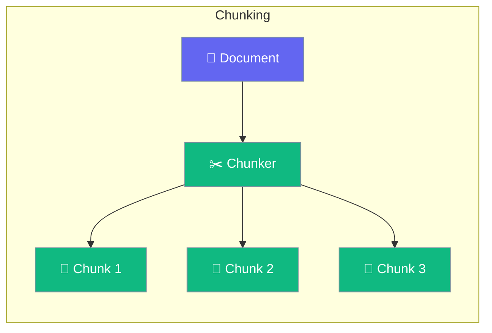
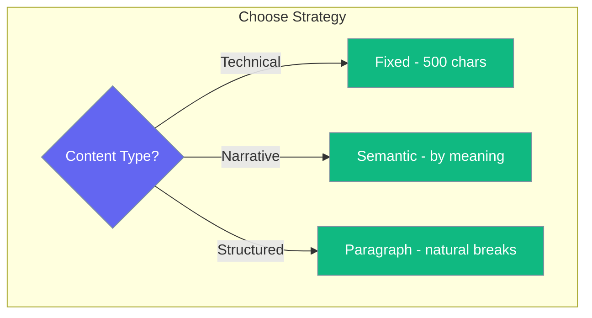

Chunking splits documents into pieces for better retrieval.



## Quick Start

<Steps>
<Step title="Configure Chunking">
```rust
use praisonai::{Agent, KnowledgeConfig, ChunkingStrategy};

let config = KnowledgeConfig::new()
    .source("docs/")
    .chunking(ChunkingStrategy::Semantic)
    .chunk_size(1000)
    .chunk_overlap(200);

let agent = Agent::new()
    .name("Assistant")
    .knowledge(config)
    .build()?;
```
</Step>
</Steps>

---

## Chunking Strategies



| Strategy | Best For |
|----------|----------|
| `Fixed` | Code, technical docs |
| `Semantic` | Articles, narratives |
| `Sentence` | Q&A, FAQs |
| `Paragraph` | Structured documents |

---

## Configuration

| Option | Type | Default | Description |
|--------|------|---------|-------------|
| `chunk_size` | `usize` | `1000` | Characters per chunk |
| `chunk_overlap` | `usize` | `200` | Overlap between chunks |
| `strategy` | `ChunkingStrategy` | `Semantic` | How to split |

---

## Related

<CardGroup cols={2}>
  <Card title="Knowledge" icon="book" href="/docs/rust/knowledge">
    RAG system
  </Card>
  <Card title="Embeddings" icon="vector-square" href="/docs/rust/embeddings">
    Vector embeddings
  </Card>
</CardGroup>
