Chunking splits documents into pieces for better retrieval.

```mermaid
graph LR
    subgraph "Chunking"
        D[📄 Document] --> C[✂️ Chunker]
        C --> C1[📝 Chunk 1]
        C --> C2[📝 Chunk 2]
        C --> C3[📝 Chunk 3]
    end
    
    classDef doc fill:#6366F1,stroke:#7C90A0,color:#fff
    classDef chunk fill:#10B981,stroke:#7C90A0,color:#fff
    
    class D doc
    class C,C1,C2,C3 chunk
```



## Quick Start

<Steps>
<Step title="Create Agent with Chunked Knowledge">
```rust
use praisonai::{Agent, Knowledge, ChunkingConfig};

// Configure chunking for knowledge base
let knowledge = Knowledge::new()
    .source("docs/")
    .chunking(ChunkingConfig::semantic()
        .chunk_size(1000)
        .overlap(200))
    .build()?;

// Add documents - they'll be automatically chunked
knowledge.add_file("guide.pdf").await?;

// Create agent that uses chunked knowledge
let agent = Agent::new()
    .name("Assistant")
    .instructions("You answer questions using the knowledge base")
    .build()?;

// Search returns relevant chunks
let chunks = knowledge.search("How do I get started?").await?;
```
</Step>
</Steps>

---

## Chunking Strategies


| Strategy | Best For |
|----------|----------|
| `Fixed` | Code, technical docs |
| `Semantic` | Articles, narratives |
| `Sentence` | Q&A, FAQs |
| `Paragraph` | Structured documents |

---

## Configuration

| Option | Type | Default | Description |
|--------|------|---------|-------------|
| `chunk_size` | `usize` | `1000` | Characters per chunk |
| `chunk_overlap` | `usize` | `200` | Overlap between chunks |
| `strategy` | `ChunkingStrategy` | `Semantic` | How to split |

---

## Related

<CardGroup cols={2}>
  <Card title="Knowledge" icon="book" href="/docs/rust/knowledge">
    RAG system
  </Card>
  <Card title="Embeddings" icon="vector-square" href="/docs/rust/embeddings">
    Vector embeddings
  </Card>
</CardGroup>
