Chunking splits documents into smaller pieces for efficient retrieval and processing.

```mermaid
graph LR
    subgraph "Chunking Pipeline"
        D[📄 Document] --> S[✂️ Split]
        S --> C1[📝 Chunk 1]
        S --> C2[📝 Chunk 2]
        S --> C3[📝 Chunk 3]
    end
    
    classDef input fill:#6366F1,stroke:#7C90A0,color:#fff
    classDef process fill:#F59E0B,stroke:#7C90A0,color:#fff
    classDef output fill:#10B981,stroke:#7C90A0,color:#fff
    
    class D input
    class S process
    class C1,C2,C3 output
```



## Quick Start

<Steps>
<Step title="Create Chunking">
```rust
use praisonai::knowledge::{Chunking, ChunkingConfig};

let config = ChunkingConfig::default();
let chunker = Chunking::new(config);

let chunks = chunker.chunk("Long document text here...");
```
</Step>

<Step title="With Configuration">
```rust
use praisonai::knowledge::{Chunking, ChunkingConfig, ChunkingStrategy};

let config = ChunkingConfig {
    chunk_size: 1000,
    chunk_overlap: 200,
    strategy: ChunkingStrategy::Sentence,
};

let chunker = Chunking::new(config);
let chunks = chunker.chunk(&document);
```
</Step>
</Steps>

---

## Configuration Options

```rust
use praisonai::knowledge::ChunkingConfig;

let config = ChunkingConfig {
    chunk_size: 1000,
    chunk_overlap: 200,
    strategy: ChunkingStrategy::FixedSize,
};
```

| Option | Type | Default | Description |
|--------|------|---------|-------------|
| `chunk_size` | `usize` | `1000` | Size in characters |
| `chunk_overlap` | `usize` | `200` | Overlap between chunks |
| `strategy` | `ChunkingStrategy` | `FixedSize` | Chunking strategy |

---

## Chunking Strategies

| Strategy | Description |
|----------|-------------|
| `FixedSize` | Fixed character count (default) |
| `Sentence` | Split by sentences |
| `Paragraph` | Split by paragraphs |
| `Semantic` | Semantically coherent chunks |

---

## Best Practices

<AccordionGroup>
  <Accordion title="Use appropriate overlap">
    Set 10-20% overlap to preserve context across chunk boundaries.
  </Accordion>
  
  <Accordion title="Choose strategy based on content">
    Use `Sentence` for articles, `Paragraph` for structured docs.
  </Accordion>
</AccordionGroup>

---

## Related

<CardGroup cols={2}>
  <Card title="RAG" icon="magnifying-glass" href="/docs/rust/rag">
    RAG pipeline
  </Card>
  <Card title="Retrieval" icon="list" href="/docs/rust/retrieval">
    Document retrieval
  </Card>
</CardGroup>
