Citations track and display source references in RAG-generated answers.

```mermaid
graph LR
    subgraph "Citations Flow"
        A[📝 Answer] --> C[📚 Citations]
        C --> S1[🔗 Source 1]
        C --> S2[🔗 Source 2]
    end
    
    classDef answer fill:#6366F1,stroke:#7C90A0,color:#fff
    classDef citations fill:#F59E0B,stroke:#7C90A0,color:#fff
    classDef source fill:#10B981,stroke:#7C90A0,color:#fff
    
    class A answer
    class C citations
    class S1,S2 source
```



## Quick Start

<Steps>
<Step title="Create Citation">
```rust
use praisonai::rag::Citation;

let citation = Citation::new("[1]", "document.pdf", "Relevant text snippet")
    .page(5)
    .score(0.95);
```
</Step>

<Step title="Use with RAG Result">
```rust
use praisonai::rag::RAG;

let rag = RAG::new().build()?;
let result = rag.query("What is the finding?")?;

for citation in &result.citations {
    println!("{}: {} (p. {:?})", 
        citation.id, 
        citation.source, 
        citation.page);
}
```
</Step>
</Steps>

---

## Citation Structure

```rust
pub struct Citation {
    pub id: String,           // "[1]"
    pub source: String,       // "document.pdf"
    pub text: String,         // Snippet
    pub page: Option<u32>,    // Page number
    pub score: Option<f32>,   // Relevance (0-1)
    pub metadata: HashMap<String, String>,
}
```

| Field | Type | Description |
|-------|------|-------------|
| `id` | `String` | Citation ID (e.g., "[1]") |
| `source` | `String` | Source document/URL |
| `text` | `String` | Relevant text snippet |
| `page` | `Option<u32>` | Page number if applicable |
| `score` | `Option<f32>` | Relevance score (0-1) |
| `metadata` | `HashMap` | Additional metadata |

---

## Citations Mode

```rust
use praisonai::rag::{RAGConfig, CitationsMode};

let config = RAGConfig::new()
    .citations_mode(CitationsMode::Inline);
```

| Mode | Description |
|------|-------------|
| `Inline` | Citations in text [1] (default) |
| `Footnote` | Footnote-style citations |
| `None` | No citations |

---

## Best Practices

<AccordionGroup>
  <Accordion title="Include page numbers">
    Add page info with `.page()` for easy verification.
  </Accordion>
  
  <Accordion title="Use score for ranking">
    Higher scores indicate more relevant citations.
  </Accordion>
</AccordionGroup>

---

## Related

<CardGroup cols={2}>
  <Card title="RAG" icon="magnifying-glass" href="/docs/rust/rag">
    RAG pipeline
  </Card>
  <Card title="Retrieval" icon="list" href="/docs/rust/retrieval">
    Document retrieval
  </Card>
</CardGroup>
