Citations let agents cite sources in their responses.

```mermaid
graph LR
    subgraph "Citations"
        K[📚 Knowledge] --> A[🤖 Agent]
        A --> R[📝 Response]
        R --> C[📖 Citations]
    end
    
    classDef knowledge fill:#6366F1,stroke:#7C90A0,color:#fff
    classDef output fill:#10B981,stroke:#7C90A0,color:#fff
    
    class K knowledge
    class A,R,C output
```



## Quick Start

<Steps>
<Step title="Enable Citations">
```rust
use praisonai::{Agent, KnowledgeConfig};

let config = KnowledgeConfig::new()
    .source("docs/")
    .citations(true);

let agent = Agent::new()
    .name("Researcher")
    .knowledge(config)
    .build()?;

let response = agent.chat("What does the policy say?").await?;
// Response includes [1], [2] citations with sources
```
</Step>
</Steps>

---

## Citation Format

```
The policy states that refunds are available within 30 days [1].
Premium members receive expedited processing [2].

Sources:
[1] policy.pdf, page 5
[2] membership.txt, line 23
```

---

## Related

<CardGroup cols={2}>
  <Card title="Knowledge" icon="book" href="/docs/rust/knowledge">
    Knowledge base
  </Card>
  <Card title="Documents" icon="file-lines" href="/docs/rust/documents">
    Load documents
  </Card>
</CardGroup>
