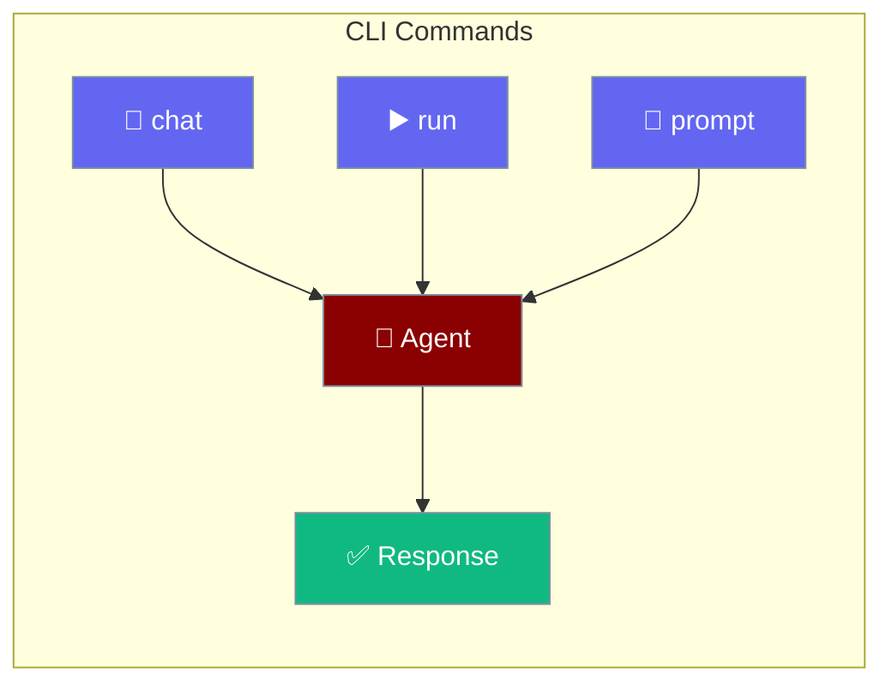

Run AI agents directly from your terminal.



## Quick Start

<Steps>

<Step title="Install CLI">
```bash
cargo install praisonai-cli
```
</Step>

<Step title="Set API Key">
```bash
export OPENAI_API_KEY="your-api-key"
```
</Step>

<Step title="Run">
```bash
praisonai-rust "What is Rust?"
```
</Step>

</Steps>

---

## Commands

### Single Prompt

```bash
# Direct prompt
praisonai-rust "What is the capital of France?"

# With model selection
praisonai-rust --model gpt-4o "Explain quantum computing"
```

### Interactive Chat

```bash
# Start chat session
praisonai-rust chat

# Chat maintains conversation history
> Hello!
AI: Hello! How can I help you today?
> What is Rust?
AI: Rust is a systems programming language...
```

### Run Workflow

```bash
# Run from YAML file
praisonai-rust run workflow.yaml
```

---

## Options

| Option | Short | Description |
|--------|-------|-------------|
| `--model <name>` | `-m` | LLM model to use |
| `--help` | `-h` | Show help |
| `--version` | `-V` | Show version |

---

## YAML Workflows

Create `agents.yaml`:

```yaml
agents:
  - name: researcher
    role: Research Assistant
    instructions: Find accurate information
    tools:
      - web_search

  - name: writer
    role: Content Writer
    instructions: Write clear, engaging content

workflow:
  - step: research
    agent: researcher
    task: Research the topic

  - step: write
    agent: writer
    task: Write article based on research
```

Run:
```bash
praisonai-rust run agents.yaml
```

---

## Environment Variables

| Variable | Description |
|----------|-------------|
| `OPENAI_API_KEY` | API key (required) |
| `PRAISONAI_MODEL` | Default model |
| `RUST_LOG` | Enable debug logging |

---

## Examples

```bash
# Simple question
praisonai-rust "What is 2+2?"

# Use GPT-4
praisonai-rust -m gpt-4o "Write a haiku about Rust"

# Debug mode
RUST_LOG=debug praisonai-rust "Hello"

# Run workflow
praisonai-rust run my-agents.yaml
```

---

## Related

<CardGroup cols={2}>
  <Card title="Installation" icon="download" href="/docs/rust/installation">
    Setup and installation
  </Card>
  <Card title="Quick Start" icon="rocket" href="/docs/rust/quickstart">
    Build your first agent
  </Card>
</CardGroup>
