Run agents directly from your terminal without writing code.

```mermaid
graph LR
    subgraph "CLI Flow"
        T[💻 Terminal] --> C[praisonai]
        C --> A[🤖 Agent]
        A --> R[📤 Result]
    end
    
    classDef terminal fill:#6366F1,stroke:#7C90A0,color:#fff
    classDef agent fill:#F59E0B,stroke:#7C90A0,color:#fff
    classDef result fill:#10B981,stroke:#7C90A0,color:#fff
    
    class T terminal
    class C,A agent
    class R result
```



## Quick Start

<Steps>
<Step title="Install CLI">
```bash
cargo install praisonai-cli
```
</Step>

<Step title="Run an Agent">
```bash
praisonai chat "What is Rust?"
```
</Step>

<Step title="Interactive Mode">
```bash
praisonai
# > What is Rust?
# Rust is a systems programming language...
# > exit
```
</Step>
</Steps>

---

## Commands

| Command | Description |
|---------|-------------|
| `praisonai chat <prompt>` | One-shot chat |
| `praisonai` | Interactive mode |
| `praisonai run <file>` | Run workflow file |
| `praisonai --model <model>` | Use specific model |
| `praisonai --help` | Show help |

---

## Examples

### With a Specific Model

```bash
praisonai --model gpt-4o chat "Explain quantum computing"
```

### Run Workflow File

```bash
praisonai run workflow.yaml
```

### Pipe Input

```bash
echo "Summarize this" | praisonai chat
```

---

## Configuration

Set defaults with environment variables:

```bash
export OPENAI_API_KEY="your-key"
export PRAISONAI_MODEL="gpt-4o"
export PRAISONAI_VERBOSE="true"
```

---

## Related

<CardGroup cols={2}>
  <Card title="Installation" icon="download" href="/docs/rust/installation">
    Setup instructions
  </Card>
  <Card title="Quick Start" icon="rocket" href="/docs/rust/quickstart">
    Code examples
  </Card>
</CardGroup>
