Enable agents to write and execute code to solve problems.

```mermaid
graph LR
    subgraph "Code Execution"
        P[📋 Problem] --> A[🤖 Agent]
        A --> C[💻 Code]
        C --> R[▶️ Run]
        R --> O[📤 Result]
    end
    
    classDef input fill:#6366F1,stroke:#7C90A0,color:#fff
    classDef code fill:#F59E0B,stroke:#7C90A0,color:#fff
    classDef output fill:#10B981,stroke:#7C90A0,color:#fff
    
    class P input
    class A,C,R code
    class O output
```



## Quick Start

<Steps>
<Step title="Create Code Execution Agent">
```rust
use praisonai::{Agent, tool};

// Define a code execution tool
#[tool(description = "Execute Python code and return the result")]
async fn run_python(code: String) -> String {
    // Execute code in sandbox
    execute_python_sandboxed(&code).await
}

// Create agent with code execution tool
let agent = Agent::new()
    .name("Coder")
    .instructions("Write and execute code to solve problems. Use the run_python tool.")
    .tool(run_python)
    .build()?;

let response = agent.chat("Calculate the first 10 Fibonacci numbers").await?;
// Agent writes Python code and executes it via the tool
```
</Step>

<Step title="Safe Code Sandbox">
```rust
use praisonai::tool;

#[tool(description = "Execute JavaScript code safely")]
async fn run_js(code: String) -> String {
    // Use sandboxed environment with timeout
    sandbox::execute_with_timeout(
        &code,
        std::time::Duration::from_secs(10)
    ).await
}
```
</Step>
</Steps>

---

## Supported Languages

| Language | Runtime |
|----------|---------|
| Python | Built-in |
| JavaScript | Node.js |
| Rust | Cargo |

---

## Security

> [!CAUTION]
> Code execution allows running arbitrary code. Use in trusted environments only.

| Safety Feature | Description |
|----------------|-------------|
| Sandbox | Isolated execution environment |
| Timeout | Max execution time |
| Resource limits | Memory and CPU caps |

---

## Related

<CardGroup cols={2}>
  <Card title="Tools" icon="wrench" href="/docs/rust/tools">
    Custom tools
  </Card>
  <Card title="Guardrails" icon="shield" href="/docs/rust/guardrails">
    Safety validation
  </Card>
</CardGroup>
