CodeAgent generates and executes code in a sandboxed environment.

```mermaid
graph LR
    subgraph "Code Execution"
        D[📝 Description] --> G[🔧 Generate]
        G --> C[💻 Code]
        C --> S[📦 Sandbox]
        S --> R[📤 Result]
    end
    
    classDef input fill:#6366F1,stroke:#7C90A0,color:#fff
    classDef process fill:#F59E0B,stroke:#7C90A0,color:#fff
    classDef output fill:#10B981,stroke:#7C90A0,color:#fff
    
    class D input
    class G,C,S process
    class R output
```



## Quick Start

<Steps>
<Step title="Create Code Agent">
```rust
use praisonai::agents::CodeAgent;

let agent = CodeAgent::new()
    .name("Coder")
    .model("gpt-4o")
    .build()?;
```
</Step>

<Step title="Generate Code">
```rust
let code = agent.generate("Calculate fibonacci sequence")?;
println!("{}", code);
```
</Step>

<Step title="Execute Code">
```rust
use praisonai::agents::{CodeAgent, CodeConfig};

let config = CodeConfig::default(); // sandbox: true

let agent = CodeAgent::new()
    .config(config)
    .build()?;

let result = agent.execute(&code)?;
println!("Output: {}", result.output);
println!("Exit code: {}", result.exit_code);
```
</Step>
</Steps>

---

## Configuration Options

```rust
use praisonai::agents::CodeConfig;
use std::collections::HashMap;

let mut env = HashMap::new();
env.insert("API_KEY".to_string(), "value".to_string());

let config = CodeConfig {
    sandbox: true,
    timeout: 30,
    allowed_languages: vec!["python".to_string()],
    max_output_length: 10000,
    working_directory: Some("/tmp".to_string()),
    environment: env,
};
```

| Option | Type | Default | Description |
|--------|------|---------|-------------|
| `sandbox` | `bool` | `true` | Enable sandbox |
| `timeout` | `u32` | `30` | Timeout (seconds) |
| `allowed_languages` | `Vec<String>` | `["python"]` | Allowed languages |
| `max_output_length` | `usize` | `10000` | Max output chars |
| `working_directory` | `Option<String>` | `None` | Working dir |
| `environment` | `HashMap<String, String>` | `{}` | Environment vars |

---

## CodeExecutionResult

```rust
pub struct CodeExecutionResult {
    pub output: String,
    pub exit_code: i32,
    pub error: Option<String>,
}
```

---

## Available Methods

| Method | Description |
|--------|-------------|
| `generate(description)` | Generate code |
| `execute(code)` | Execute code |
| `review(code)` | Review code |

---

## Best Practices

<AccordionGroup>
  <Accordion title="Always use sandbox">
    Keep `sandbox: true` for security.
  </Accordion>
  
  <Accordion title="Set timeouts">
    Use reasonable timeouts to prevent runaway code.
  </Accordion>
  
  <Accordion title="Limit allowed languages">
    Only enable languages you need.
  </Accordion>
</AccordionGroup>

---

## Related

<CardGroup cols={2}>
  <Card title="Agent" icon="robot" href="/docs/rust/agent">
    Agent API
  </Card>
  <Card title="Sandbox" icon="box" href="/docs/rust/sandbox">
    Sandbox environment
  </Card>
</CardGroup>
