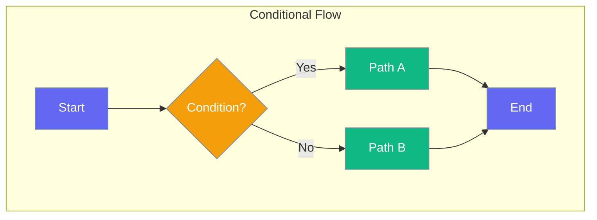
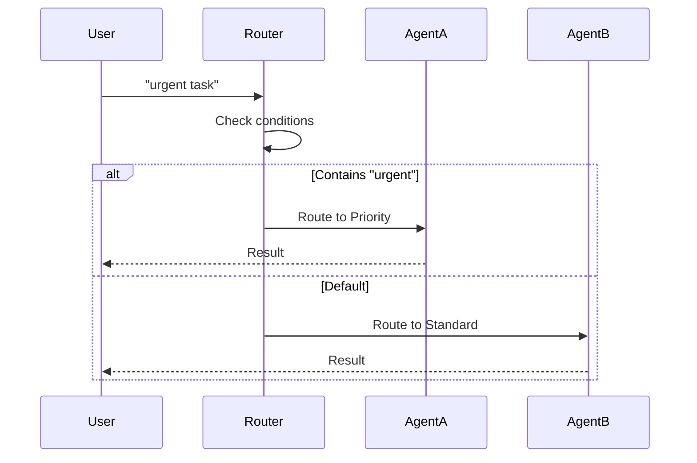

Conditions let you control workflow branching based on runtime decisions.



## Quick Start

<Steps>
<Step title="Simple Condition">
```rust
use praisonai::{Agent, when};

let route = when(|input| input.contains("urgent"))
    .then(priority_agent)
    .otherwise(standard_agent);

route.run("urgent: fix bug").await?;
// Routes to priority_agent
```
</Step>

<Step title="Multiple Conditions">
```rust
use praisonai::when;

let router = when(|i| i.contains("code"))
    .then(coder)
    .when(|i| i.contains("write"))
    .then(writer)
    .otherwise(assistant);
```
</Step>
</Steps>

---

## How It Works



---

## Common Patterns

### Intent-Based Routing

```rust
use praisonai::when;

let router = when(|input| classify(input) == "technical")
    .then(tech_support)
    .when(|input| classify(input) == "billing")
    .then(billing_support)
    .otherwise(general_support);
```

### Priority Handling

```rust
use praisonai::when;

let router = when(|input| is_vip_customer(input))
    .then(vip_agent)
    .otherwise(standard_agent);
```

---

## Best Practices

<AccordionGroup>
  <Accordion title="Keep conditions simple">
    Complex conditions are hard to debug. Break into smaller checks.
  </Accordion>
  
  <Accordion title="Always have an otherwise">
    Provide a fallback for unmatched conditions.
  </Accordion>
</AccordionGroup>

---

## Related

<CardGroup cols={2}>
  <Card title="Loops" icon="rotate" href="/docs/rust/loops">
    Repeated execution
  </Card>
  <Card title="Workflows" icon="sitemap" href="/docs/rust/flow">
    Complex flows
  </Card>
</CardGroup>
