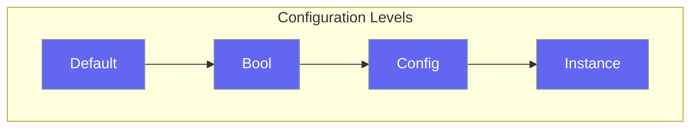

Configure agents with sensible defaults and easy customization.



## Configuration Pattern

Every feature follows the same pattern - start simple, add detail as needed:

<Steps>
<Step title="Level 1: Minimal">
```rust
use praisonai::Agent;

// Uses all defaults - just provide name
let agent = Agent::new()
    .name("Assistant")
    .build()?;
```
</Step>

<Step title="Level 2: Basic Settings">
```rust
use praisonai::Agent;

// Common configuration options
let agent = Agent::new()
    .name("Assistant")
    .instructions("You are a helpful assistant")
    .model("gpt-4o")
    .memory(true)      // Enable memory
    .verbose(true)     // Enable verbose output
    .build()?;
```
</Step>

<Step title="Level 3: Full Configuration">
```rust
use praisonai::{Agent, MemoryConfig};

// Complete configuration with all options
let agent = Agent::new()
    .name("Research Assistant")
    .instructions("You research topics thoroughly")
    .model("gpt-4o")
    .api_key("sk-...")
    .base_url("https://api.openai.com/v1")
    .temperature(0.7)
    .max_tokens(4096)
    .memory_config(MemoryConfig::new().max_messages(100))
    .max_iterations(15)
    .stream(true)
    .verbose(true)
    .build()?;
```
</Step>
</Steps>

---

## All Configurations

| Config | Purpose | Default |
|--------|---------|---------|
| `MemoryConfig` | Conversation memory | Short-term enabled |
| `PlanningConfig` | Planning mode | Disabled |
| `ExecutionConfig` | Limits and timeouts | 10 iterations, 300s |
| `OutputConfig` | Output format | Verbose |
| `KnowledgeConfig` | RAG settings | Auto-retrieve |
| `GuardrailConfig` | Safety validation | Disabled |

---

## Environment Variables

Configure via environment:

```bash
export OPENAI_API_KEY="your-key"
export PRAISONAI_MODEL="gpt-4o"
export PRAISONAI_VERBOSE="true"
export PRAISONAI_TIMEOUT="60"
```

---

## Best Practices

<AccordionGroup>
  <Accordion title="Start with defaults">
    Defaults are chosen for common use cases. Customize only when needed.
  </Accordion>
  
  <Accordion title="Use environment variables for secrets">
    Never hardcode API keys in source code.
  </Accordion>
  
  <Accordion title="Use booleans for quick toggles">
    Use Config classes when you need fine-grained control.
  </Accordion>
</AccordionGroup>

---

## Related

<CardGroup cols={2}>
  <Card title="Agent" icon="robot" href="/docs/rust/agent">
    Agent options
  </Card>
  <Card title="Execution" icon="play" href="/docs/rust/execution">
    Execution limits
  </Card>
</CardGroup>
