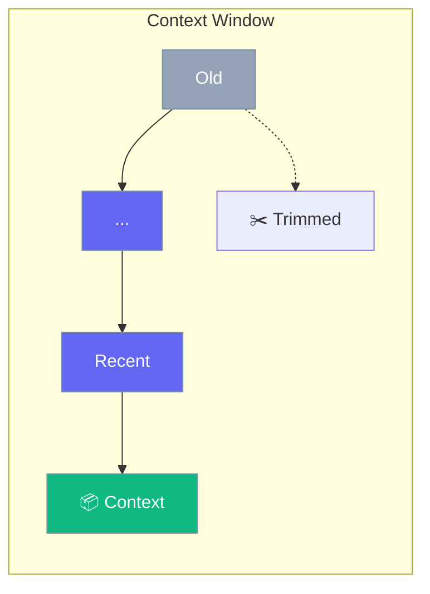

Context management controls how much history the agent remembers.



## Quick Start

<Steps>
<Step title="Create Agent with Context Limits">
```rust
use praisonai::{Agent, MemoryConfig};

let agent = Agent::new()
    .name("Assistant")
    .instructions("You are a helpful assistant")
    .memory_config(MemoryConfig::new().max_messages(50))  // Keep last 50 messages
    .build()?;

// Agent will automatically trim old messages
let response = agent.chat("Hello!").await?;
```
</Step>

<Step title="Configure Memory Strategy">
```rust
use praisonai::{Agent, MemoryConfig};

let config = MemoryConfig::new()
    .max_messages(100)
    .use_short_term(true);

let agent = Agent::new()
    .name("Assistant")
    .memory_config(config)
    .build()?;
```
</Step>
</Steps>

---

## Context Strategies

| Strategy | Description |
|----------|-------------|
| Sliding window | Keep last N messages |
| Summarization | Compress old messages |
| Selective | Keep important messages |

---

## Related

<CardGroup cols={2}>
  <Card title="Memory" icon="brain" href="/docs/rust/memory">
    Memory system
  </Card>
  <Card title="Sessions" icon="user" href="/docs/rust/sessions">
    Session persistence
  </Card>
</CardGroup>
