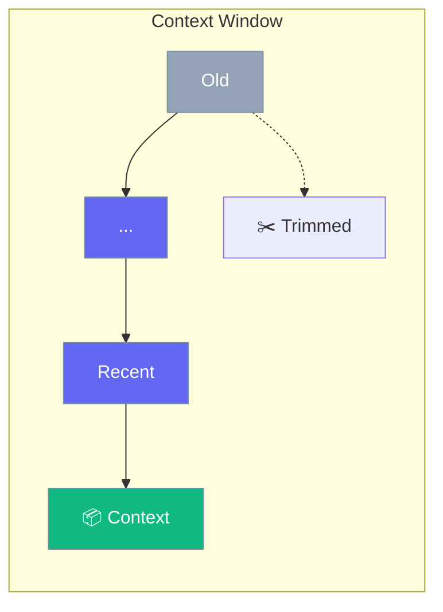

Context management controls how much history the agent remembers.



## Quick Start

<Steps>
<Step title="Limit Context">
```rust
use praisonai::{Agent, MemoryConfig};

let config = MemoryConfig::new()
    .max_messages(50);  // Keep last 50 messages

let agent = Agent::new()
    .name("Assistant")
    .memory(config)
    .build()?;
```
</Step>

<Step title="Summarize Old Context">
```rust
let config = MemoryConfig::new()
    .summarize_after(20)  // Summarize old messages
    .max_messages(50);
```
</Step>
</Steps>

---

## Context Strategies

| Strategy | Description |
|----------|-------------|
| Sliding window | Keep last N messages |
| Summarization | Compress old messages |
| Selective | Keep important messages |

---

## Related

<CardGroup cols={2}>
  <Card title="Memory" icon="brain" href="/docs/rust/memory">
    Memory system
  </Card>
  <Card title="Sessions" icon="user" href="/docs/rust/sessions">
    Session persistence
  </Card>
</CardGroup>
