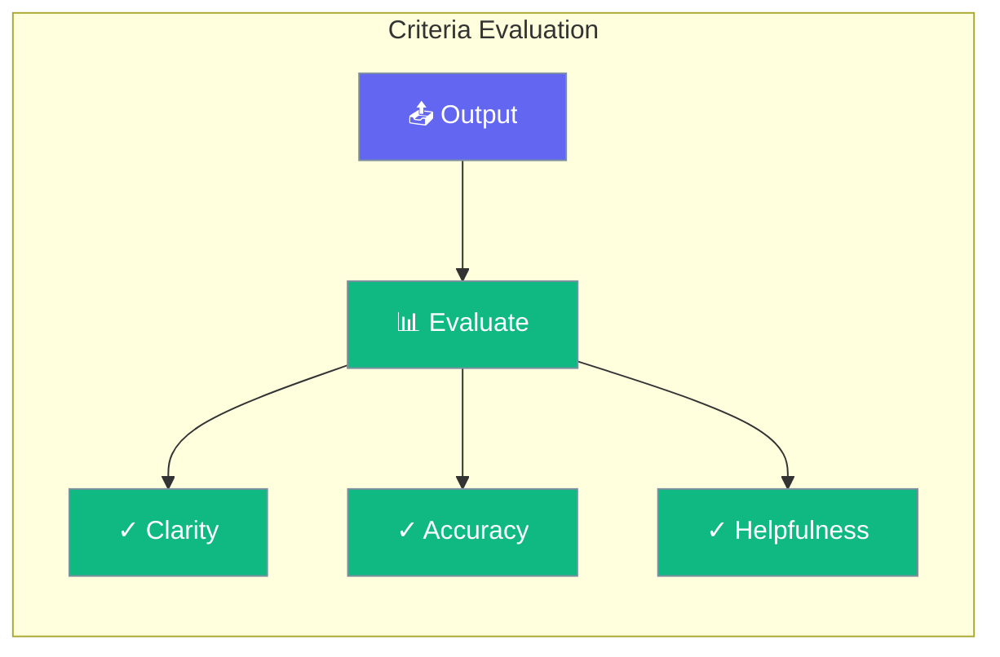

Criteria evaluation measures agent output against custom standards.



## Quick Start

<Steps>
<Step title="Define Criteria">
```rust
use praisonai::CriteriaEvaluator;

let evaluator = CriteriaEvaluator::new()
    .criterion("clarity", "Is the response clear and easy to understand?")
    .criterion("accuracy", "Is the information factually correct?")
    .criterion("completeness", "Does it fully answer the question?")
    .build();

let scores = evaluator.evaluate(&response);
for (name, score) in scores {
    println!("{}: {:.0}%", name, score * 100.0);
}
```
</Step>
</Steps>

---

## Common Criteria

| Criterion | Description |
|-----------|-------------|
| Clarity | Easy to understand |
| Accuracy | Factually correct |
| Completeness | Fully addresses query |
| Conciseness | No unnecessary content |
| Helpfulness | Actionable and useful |

---

## Related

<CardGroup cols={2}>
  <Card title="Evaluation" icon="chart-bar" href="/docs/rust/evaluation">
    Evaluation system
  </Card>
  <Card title="Optimizer" icon="wand-sparkles" href="/docs/rust/optimizer">
    Auto-improvement
  </Card>
</CardGroup>
