Criteria enables structured evaluation of agent outputs against defined standards.

```mermaid
graph LR
    subgraph "Criteria Evaluation"
        O[📤 Output] --> E[⚖️ Evaluate]
        E --> S[📊 Score]
    end
    
    classDef output fill:#6366F1,stroke:#7C90A0,color:#fff
    classDef eval fill:#F59E0B,stroke:#7C90A0,color:#fff
    classDef score fill:#10B981,stroke:#7C90A0,color:#fff
    
    class O output
    class E eval
    class S score
```



## Quick Start

<Steps>
<Step title="Create Evaluator">
```rust
use praisonai::eval::CriteriaEvaluator;

let evaluator = CriteriaEvaluator::new()
    .criterion("accuracy", 0.8)
    .criterion("completeness", 0.7)
    .build()?;
```
</Step>

<Step title="Evaluate Output">
```rust
let result = evaluator.evaluate(&output).await?;

for score in &result.scores {
    println!("{}: {}", score.name, score.value);
}
```
</Step>
</Steps>

---

## CriteriaScore

```rust
pub struct CriteriaScore {
    pub name: String,
    pub value: f32,
    pub threshold: f32,
    pub passed: bool,
}
```

| Field | Type | Description |
|-------|------|-------------|
| `name` | `String` | Criterion name |
| `value` | `f32` | Actual score (0-1) |
| `threshold` | `f32` | Minimum required |
| `passed` | `bool` | Met threshold |

---

## CriteriaResult

```rust
pub struct CriteriaResult {
    pub scores: Vec<CriteriaScore>,
    pub overall_passed: bool,
    pub overall_score: f32,
}
```

---

## Best Practices

<AccordionGroup>
  <Accordion title="Define clear criteria">
    Use specific, measurable criteria names.
  </Accordion>
  
  <Accordion title="Set realistic thresholds">
    Start with achievable thresholds and adjust.
  </Accordion>
</AccordionGroup>

---

## Related

<CardGroup cols={2}>
  <Card title="Evaluation" icon="chart-bar" href="/docs/rust/evaluation">
    Agent evaluation
  </Card>
  <Card title="Reflection" icon="mirror" href="/docs/rust/reflection">
    Self-improvement
  </Card>
</CardGroup>
