Database integration provides persistent and in-memory storage for agent knowledge and sessions.

```mermaid
graph LR
    subgraph "Storage Options"
        A[🤖 Agent] --> M[🧠 InMemoryVectorStore]
        A --> F[📁 FileSessionStore]
        M --> Q[🔍 Search]
        F --> P[💾 Persist]
    end
    
    classDef agent fill:#6366F1,stroke:#7C90A0,color:#fff
    classDef memory fill:#F59E0B,stroke:#7C90A0,color:#fff
    classDef file fill:#10B981,stroke:#7C90A0,color:#fff
    
    class A agent
    class M memory
    class F,Q,P file
```



## Quick Start

<Steps>
<Step title="In-Memory Vector Store">
```rust
use praisonai::{Agent, InMemoryVectorStore, VectorRecord};

// Create vector store for semantic search
let mut store = InMemoryVectorStore::new();

// Add knowledge
let record = VectorRecord::new("doc-1", "AI agents are autonomous systems")
    .with_embedding(vec![0.1, 0.2, 0.3]);
store.add(record).await?;

// Create agent with knowledge
let agent = Agent::new()
    .name("Researcher")
    .knowledge(store)
    .build()?;

agent.start("What are AI agents?").await?;
```
</Step>

<Step title="File-Based Sessions">
```rust
use praisonai::{Agent, FileSessionStore};

// Persist conversations to disk
let store = FileSessionStore::new();

let agent = Agent::new()
    .name("Assistant")
    .session_store(store)
    .build()?;

// Conversations persist across restarts
agent.start("Remember this context").await?;
```
</Step>
</Steps>

---

## User Interaction Flow


---

## InMemoryVectorStore

Fast, in-memory vector storage for development and small knowledge bases.

```rust
pub struct InMemoryVectorStore {
    records: Vec<VectorRecord>,
}
```

### Methods

| Method | Signature | Description |
|--------|-----------|-------------|
| `new()` | `fn new() -> Self` | Create empty store |
| `add(record)` | `async fn add(&mut self, VectorRecord) -> Result<String>` | Add a record |
| `search(embedding, limit)` | `async fn search(&self, &[f32], usize) -> Result<Vec<SearchResultItem>>` | Search by embedding |
| `get(id)` | `async fn get(&self, &str) -> Result<Option<VectorRecord>>` | Get by ID |
| `delete(id)` | `async fn delete(&mut self, &str) -> Result<bool>` | Delete by ID |

### Example

```rust
use praisonai::{InMemoryVectorStore, VectorRecord, VectorStoreProtocol};

let mut store = InMemoryVectorStore::new();

// Add records with embeddings
let record = VectorRecord::new("id-1", "Document content")
    .with_embedding(vec![0.1, 0.2, 0.3, 0.4]);

store.add(record).await?;

// Search for similar content
let results = store.search(&[0.1, 0.2, 0.3, 0.4], 5).await?;
for item in results {
    println!("Found: {} (score: {})", item.text, item.score);
}
```

---

## FileSessionStore

Persistent file-based storage for session data.

```rust
pub struct FileSessionStore {
    session_dir: PathBuf,
    max_messages: usize,
}
```

### Configuration Options

| Option | Type | Default | Description |
|--------|------|---------|-------------|
| `session_dir` | `PathBuf` | `~/.praisonai/sessions/` | Storage directory |
| `max_messages` | `usize` | `100` | Max messages per session |

### Methods

| Method | Signature | Description |
|--------|-----------|-------------|
| `new()` | `fn new() -> Self` | Default directory |
| `with_dir(dir)` | `fn with_dir(impl Into<PathBuf>) -> Self` | Custom directory |
| `max_messages(n)` | `fn max_messages(self, usize) -> Self` | Set limit |

---

## Storage Comparison

| Store | Persistence | Use Case | Performance |
|-------|-------------|----------|-------------|
| `InMemoryVectorStore` | Memory only | Development, testing | ⚡ Fastest |
| `FileSessionStore` | Disk | Production sessions | 💾 Durable |

---

## Best Practices

<AccordionGroup>
  <Accordion title="Use InMemoryVectorStore for development">
    Fast iteration without database setup. Switch to persistent store for production.
  </Accordion>
  
  <Accordion title="Set message limits for long-running agents">
    Use `FileSessionStore::new().max_messages(100)` to prevent unbounded growth.
  </Accordion>
  
  <Accordion title="Index by semantic meaning, not keywords">
    Vector stores search by embedding similarity - structure your documents for semantic retrieval.
  </Accordion>
</AccordionGroup>

---

## Related

<CardGroup cols={2}>
  <Card title="Vector Store" icon="database" href="/docs/rust/vector-store">
    Vector store protocol
  </Card>
  <Card title="Knowledge" icon="book" href="/docs/rust/knowledge">
    Knowledge management
  </Card>
</CardGroup>
