Database provides storage backends for agent data.

```mermaid
graph LR
    subgraph "Database Layer"
        A[🤖 Agent] --> D[💾 Database]
        D --> S[📦 Storage]
    end
    
    classDef agent fill:#6366F1,stroke:#7C90A0,color:#fff
    classDef db fill:#F59E0B,stroke:#7C90A0,color:#fff
    classDef storage fill:#10B981,stroke:#7C90A0,color:#fff
    
    class A agent
    class D db
    class S storage
```



## Quick Start

<Steps>
<Step title="File-Based Storage">
```rust
use praisonai::session::FileSessionStore;

let store = FileSessionStore::new("/data/sessions");
```
</Step>

<Step title="In-Memory Storage">
```rust
use praisonai::knowledge::InMemoryVectorStore;

let store = InMemoryVectorStore::new();
```
</Step>
</Steps>

---

## Storage Options

| Storage | Use Case |
|---------|----------|
| `InMemoryVectorStore` | Development, testing |
| `FileSessionStore` | Persistent sessions |

---

## Best Practices

<AccordionGroup>
  <Accordion title="Use in-memory for dev">
    InMemoryVectorStore is fastest for development.
  </Accordion>
  
  <Accordion title="Persist production data">
    Use file-based storage for production.
  </Accordion>
</AccordionGroup>

---

## Related

<CardGroup cols={2}>
  <Card title="Vector Store" icon="database" href="/docs/rust/vector-store">
    Vector storage
  </Card>
  <Card title="Sessions" icon="user" href="/docs/rust/sessions">
    Session management
  </Card>
</CardGroup>
