Display options for formatting agent output.

```mermaid
graph LR
    subgraph "Display Options"
        A[🤖 Agent] --> D{Format}
        D --> T[📝 Text]
        D --> M[📊 Markdown]
        D --> J[📋 JSON]
    end
    
    classDef agent fill:#6366F1,stroke:#7C90A0,color:#fff
    classDef format fill:#10B981,stroke:#7C90A0,color:#fff
    
    class A agent
    class D,T,M,J format
```



## Quick Start

<Steps>
<Step title="Markdown Output">
```rust
use praisonai::Agent;

let agent = Agent::new()
    .name("Writer")
    .instructions("Format responses in markdown")
    .build()?;
```
</Step>

<Step title="Custom Formatting">
```rust
let agent = Agent::new()
    .name("Assistant")
    .on_message(|msg| {
        // Custom display logic
        render_markdown(&msg);
    })
    .build()?;
```
</Step>
</Steps>

---

## Related

<CardGroup cols={2}>
  <Card title="Output" icon="brackets-curly" href="/docs/rust/output">
    Output modes
  </Card>
  <Card title="Streaming" icon="stream" href="/docs/rust/streaming">
    Stream output
  </Card>
</CardGroup>
