Load and process documents for agent knowledge.

```mermaid
graph LR
    subgraph "Document Processing"
        F[📁 Files] --> L[📥 Loader]
        L --> D[📄 Documents]
        D --> K[📚 Knowledge]
    end
    
    classDef file fill:#6366F1,stroke:#7C90A0,color:#fff
    classDef doc fill:#10B981,stroke:#7C90A0,color:#fff
    
    class F file
    class L,D,K doc
```



## Quick Start

<Steps>
<Step title="Load Documents">
```rust
use praisonai::{Agent, Knowledge};

let knowledge = Knowledge::new()
    .add_file("report.pdf")
    .add_file("notes.txt")
    .add_directory("docs/")
    .build()?;

let agent = Agent::new()
    .name("Analyst")
    .knowledge(knowledge)
    .build()?;

agent.chat("Summarize the report").await?;
```
</Step>
</Steps>

---

## Supported Formats

| Format | Extension |
|--------|-----------|
| PDF | `.pdf` |
| Text | `.txt` |
| Markdown | `.md` |
| Word | `.docx` |
| HTML | `.html` |

---

## Related

<CardGroup cols={2}>
  <Card title="Knowledge" icon="book" href="/docs/rust/knowledge">
    Knowledge base
  </Card>
  <Card title="Chunking" icon="scissors" href="/docs/rust/chunking">
    Split documents
  </Card>
</CardGroup>
