Documents represent text content for knowledge management.

```mermaid
graph LR
    subgraph "Document Flow"
        F[📄 File] --> D[📋 Document]
        D --> C[✂️ Chunks]
        C --> K[📚 Knowledge]
    end
    
    classDef file fill:#6366F1,stroke:#7C90A0,color:#fff
    classDef process fill:#F59E0B,stroke:#7C90A0,color:#fff
    classDef output fill:#10B981,stroke:#7C90A0,color:#fff
    
    class F file
    class D,C process
    class K output
```



## Quick Start

<Steps>
<Step title="Create Document">
```rust
use praisonai::knowledge::Document;

let doc = Document::new("doc-1", "Document content here")
    .source("file.pdf")
    .metadata("author", "John Doe");
```
</Step>

<Step title="Add to Knowledge Base">
```rust
use praisonai::knowledge::Knowledge;

let mut kb = Knowledge::new().build()?;
kb.add_document(doc).await?;
```
</Step>
</Steps>

---

## Document Structure

```rust
pub struct Document {
    pub id: String,
    pub content: String,
    pub source: Option<String>,
    pub metadata: HashMap<String, String>,
}
```

| Field | Type | Description |
|-------|------|-------------|
| `id` | `String` | Unique identifier |
| `content` | `String` | Text content |
| `source` | `Option<String>` | Source file/URL |
| `metadata` | `HashMap` | Additional metadata |

---

## Creating Documents

```rust
// From string
let doc = Document::new("id", "content");

// With source
let doc = Document::new("id", "content")
    .source("https://example.com/file.pdf");

// With metadata
let doc = Document::new("id", "content")
    .metadata("author", "Jane")
    .metadata("date", "2024-01-01");
```

---

## Best Practices

<AccordionGroup>
  <Accordion title="Use meaningful IDs">
    IDs should be unique and descriptive (e.g., "file-chapter1").
  </Accordion>
  
  <Accordion title="Add source information">
    Track original source for citations.
  </Accordion>
</AccordionGroup>

---

## Related

<CardGroup cols={2}>
  <Card title="Knowledge" icon="brain" href="/docs/rust/knowledge">
    Knowledge management
  </Card>
  <Card title="Chunking" icon="puzzle-piece" href="/docs/rust/chunking">
    Text chunking
  </Card>
</CardGroup>
