Embed agents directly into your applications.

```mermaid
graph LR
    subgraph "Embedding"
        A[📱 App] --> E[🔌 Embed]
        E --> AG[🤖 Agent]
    end
    
    classDef app fill:#6366F1,stroke:#7C90A0,color:#fff
    classDef agent fill:#10B981,stroke:#7C90A0,color:#fff
    
    class A app
    class E,AG agent
```



## Quick Start

<Steps>
<Step title="Embed in Application">
```rust
use praisonai::Agent;

// Create agent as part of your application
let agent = Agent::new()
    .name("Assistant")
    .build()?;

// Use in your app logic
async fn handle_user_query(query: &str) -> String {
    agent.chat(query).await.unwrap()
}
```
</Step>
</Steps>

---

## Embedding Options

| Platform | Method |
|----------|--------|
| Rust apps | Direct library |
| Web apps | WebAssembly |
| CLI tools | Binary inclusion |

---

## Related

<CardGroup cols={2}>
  <Card title="Installation" icon="download" href="/docs/rust/installation">
    Setup guide
  </Card>
  <Card title="Agent" icon="robot" href="/docs/rust/agent">
    Agent config
  </Card>
</CardGroup>
