Embeddings convert text to vectors for semantic similarity and search.

```mermaid
graph LR
    subgraph "Embeddings"
        T[📝 Text] --> E[🔢 Embedder]
        E --> V[📊 Vector]
        V --> S[🔍 Search]
    end
    
    classDef text fill:#6366F1,stroke:#7C90A0,color:#fff
    classDef vector fill:#10B981,stroke:#7C90A0,color:#fff
    
    class T text
    class E,V,S vector
```



## Quick Start

<Steps>
<Step title="Create Embeddings">
```rust
use praisonai::Embedder;

let embedder = Embedder::new("openai");

let vector = embedder.embed("Hello world").await?;
println!("Dimensions: {}", vector.len());
```
</Step>

<Step title="Use with Knowledge">
```rust
use praisonai::{Agent, KnowledgeConfig};

let config = KnowledgeConfig::new()
    .embedder("openai")
    .source("docs/");

let agent = Agent::new()
    .name("Assistant")
    .knowledge(config)
    .build()?;

// Knowledge automatically uses embeddings for search
```
</Step>
</Steps>

---

## Embedder Options

| Embedder | Model | Dimensions |
|----------|-------|------------|
| `openai` | text-embedding-3-small | 1536 |
| `cohere` | embed-english-v3 | 1024 |
| `local` | all-MiniLM-L6-v2 | 384 |

---

## Related

<CardGroup cols={2}>
  <Card title="Knowledge" icon="book" href="/docs/rust/knowledge">
    RAG system
  </Card>
  <Card title="Database" icon="database" href="/docs/rust/database">
    Vector storage
  </Card>
</CardGroup>
