Handle errors gracefully to build robust agent applications.

```mermaid
graph LR
    subgraph "Error Handling"
        A[🤖 Agent] --> E{Error?}
        E --> |Yes| H[🛠️ Handle]
        E --> |No| S[✅ Success]
        H --> R[🔄 Retry]
        H --> F[📝 Log]
    end
    
    classDef agent fill:#6366F1,stroke:#7C90A0,color:#fff
    classDef error fill:#EF4444,stroke:#7C90A0,color:#fff
    classDef success fill:#10B981,stroke:#7C90A0,color:#fff
    
    class A agent
    class E,H,R,F error
    class S success
```



## Quick Start

<Steps>
<Step title="Handle Errors">
```rust
use praisonai::Agent;

let agent = Agent::new()
    .name("Assistant")
    .build()?;

match agent.chat("Hello").await {
    Ok(response) => println!("{}", response),
    Err(e) => println!("Error: {}", e),
}
```
</Step>

<Step title="With Retries">
```rust
use praisonai::{Agent, ExecutionConfig};

let config = ExecutionConfig::new()
    .max_retries(3);

let agent = Agent::new()
    .name("Reliable Bot")
    .execution(config)
    .build()?;
```
</Step>
</Steps>

---

## Error Types

| Error | Cause | Solution |
|-------|-------|----------|
| `ApiError` | API call failed | Check API key, retry |
| `TimeoutError` | Request too slow | Increase timeout |
| `ToolError` | Tool execution failed | Check tool logic |
| `ConfigError` | Invalid configuration | Check config values |

---

## Common Patterns

### Graceful Fallback

```rust
let response = agent.chat("Question").await
    .unwrap_or_else(|_| "Sorry, I encountered an error.".to_string());
```

### Logging Errors

```rust
if let Err(e) = agent.chat("Question").await {
    log::error!("Agent error: {}", e);
    // Handle gracefully
}
```

---

## Best Practices

<AccordionGroup>
  <Accordion title="Always handle errors">
    Never use unwrap() in production code.
  </Accordion>
  
  <Accordion title="Set appropriate retries">
    3 retries is usually enough for transient failures.
  </Accordion>
  
  <Accordion title="Log errors for debugging">
    Keep detailed logs to diagnose issues later.
  </Accordion>
</AccordionGroup>

---

## Related

<CardGroup cols={2}>
  <Card title="Execution" icon="play" href="/docs/rust/execution">
    Execution limits
  </Card>
  <Card title="Callbacks" icon="phone" href="/docs/rust/callbacks">
    Error callbacks
  </Card>
</CardGroup>
