Evaluation measures how well your agents perform, helping you improve over time.

```mermaid
graph LR
    subgraph "Evaluation Loop"
        A[🤖 Agent] --> O[📤 Output]
        O --> E[📊 Evaluate]
        E --> S[📈 Score]
        S --> I[🔧 Improve]
        I --> A
    end
    
    classDef agent fill:#6366F1,stroke:#7C90A0,color:#fff
    classDef eval fill:#F59E0B,stroke:#7C90A0,color:#fff
    classDef result fill:#10B981,stroke:#7C90A0,color:#fff
    
    class A agent
    class O,E,S eval
    class I result
```



## Quick Start

<Steps>
<Step title="Evaluate Response">
```rust
use praisonai::{Agent, AccuracyEvaluator};

let agent = Agent::new().name("Assistant").build()?;
let evaluator = AccuracyEvaluator::new();

let response = agent.chat("What is 2+2?").await?;
let score = evaluator.evaluate(&response, "4");

println!("Accuracy: {:.1}%", score.value * 100.0);
```
</Step>

<Step title="Multiple Criteria">
```rust
use praisonai::CriteriaEvaluator;

let evaluator = CriteriaEvaluator::new()
    .criterion("clarity", "Is the response clear?")
    .criterion("accuracy", "Is the response accurate?")
    .build();

let scores = evaluator.evaluate(&response);
```
</Step>
</Steps>

---

## Evaluator Types

| Evaluator | Measures |
|-----------|----------|
| `AccuracyEvaluator` | Correctness vs expected |
| `CriteriaEvaluator` | Multiple custom criteria |
| `PerformanceEvaluator` | Speed and efficiency |
| `Judge` | LLM-as-judge scoring |

---

## Best Practices

<AccordionGroup>
  <Accordion title="Test on diverse examples">
    Use varied test cases to get accurate evaluation.
  </Accordion>
  
  <Accordion title="Iterate based on scores">
    Low scores indicate where to improve prompts or tools.
  </Accordion>
</AccordionGroup>

---

## Related

<CardGroup cols={2}>
  <Card title="Optimizer" icon="wand-sparkles" href="/docs/rust/optimizer">
    Auto-improve agents
  </Card>
  <Card title="Tracing" icon="chart-line" href="/docs/rust/tracing">
    Performance tracing
  </Card>
</CardGroup>
