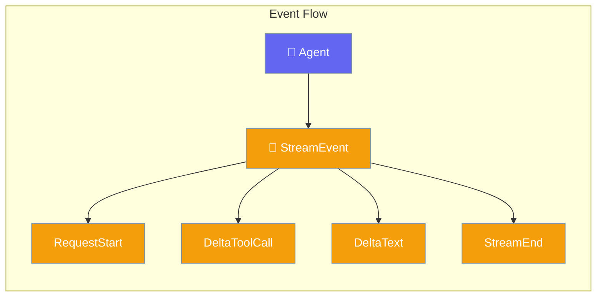

Events notify you when important things happen during agent execution. Use the StreamEvent system to track agent progress.



## Quick Start

<Steps>
<Step title="Create and Handle Events">
```rust
use praisonai::{StreamEvent, StreamEventType};

fn handle_event(event: &StreamEvent) {
    match event.event_type {
        StreamEventType::RequestStart => println!("🚀 Starting..."),
        StreamEventType::FirstToken => println!("💬 First response"),
        StreamEventType::DeltaText => {
            if let Some(content) = &event.content {
                print!("{}", content);
            }
        }
        StreamEventType::DeltaToolCall => println!("🔧 Tool call"),
        StreamEventType::ToolCallEnd => println!("✅ Tool done"),
        StreamEventType::StreamEnd => println!("\n🏁 Complete"),
        StreamEventType::Error => {
            if let Some(err) = &event.error {
                eprintln!("❌ Error: {}", err);
            }
        }
        _ => {}
    }
}
```
</Step>

<Step title="Create Events">
```rust
use praisonai::StreamEvent;

// Factory methods for common events
let start = StreamEvent::request_start();
let text = StreamEvent::delta_text("Hello, world!");
let end = StreamEvent::stream_end();
let error = StreamEvent::error_event("Something went wrong");
```
</Step>
</Steps>

---

## StreamEventType

| Event | When |
|-------|------|
| `RequestStart` | Before API call |
| `HeadersReceived` | HTTP headers arrive |
| `FirstToken` | First content received |
| `DeltaText` | Text content chunk |
| `DeltaToolCall` | Tool call in progress |
| `ToolCallEnd` | Tool finished executing |
| `LastToken` | Final content chunk |
| `StreamEnd` | Stream completed |
| `Error` | Error occurred |

---

## StreamEvent Structure

```rust
pub struct StreamEvent {
    pub event_type: StreamEventType,
    pub content: Option<String>,
    pub tool_call: Option<ToolCallData>,
    pub error: Option<String>,
    pub timestamp: DateTime<Utc>,
    pub is_reasoning: bool,
    pub agent_id: Option<String>,
    pub session_id: Option<String>,
}
```

---

## Related

<CardGroup cols={2}>
  <Card title="Streaming" icon="stream" href="/docs/rust/streaming">
    Enable streaming responses
  </Card>
  <Card title="Callbacks" icon="phone" href="/docs/rust/callbacks">
    React to stream events
  </Card>
</CardGroup>
