Events enable tracking and responding to agent lifecycle changes.

```mermaid
graph LR
    subgraph "Event Flow"
        A[🤖 Agent] --> E[📢 Event]
        E --> L1[👂 Listener 1]
        E --> L2[👂 Listener 2]
    end
    
    classDef agent fill:#6366F1,stroke:#7C90A0,color:#fff
    classDef event fill:#F59E0B,stroke:#7C90A0,color:#fff
    classDef listener fill:#10B981,stroke:#7C90A0,color:#fff
    
    class A agent
    class E event
    class L1,L2 listener
```



## Quick Start

<Steps>
<Step title="Listen to Events">
```rust
use praisonai::{Agent, events::EventType};

let agent = Agent::new()
    .on_event(EventType::Start, |_| {
        println!("Agent started!");
    })
    .on_event(EventType::Complete, |result| {
        println!("Done: {}", result);
    })
    .build()?;
```
</Step>

<Step title="Custom Event Handler">
```rust
use praisonai::events::{EventBus, Event};

let bus = EventBus::new();

bus.subscribe(|event: Event| {
    match event.event_type {
        EventType::ToolCall => println!("Tool: {}", event.data),
        EventType::Error => eprintln!("Error: {}", event.data),
        _ => {}
    }
});
```
</Step>
</Steps>

---

## Event Types

| Event | Description |
|-------|-------------|
| `Start` | Agent begins execution |
| `Complete` | Agent finishes |
| `ToolCall` | Tool invoked |
| `ToolResult` | Tool returned |
| `Handoff` | Agent handoff |
| `Error` | Error occurred |

---

## Configuration Options

```rust
use praisonai::events::EventConfig;

let config = EventConfig::new()
    .buffer_size(100)
    .async_dispatch(true);
```

| Option | Type | Default | Description |
|--------|------|---------|-------------|
| `buffer_size` | `usize` | `100` | Event buffer |
| `async_dispatch` | `bool` | `true` | Async event dispatch |

---

## Best Practices

<AccordionGroup>
  <Accordion title="Keep handlers lightweight">
    Event handlers should be fast; offload heavy work to tasks.
  </Accordion>
  
  <Accordion title="Handle errors in listeners">
    Wrap handler code in error handling to prevent crashes.
  </Accordion>
</AccordionGroup>

---

## Related

<CardGroup cols={2}>
  <Card title="Callbacks" icon="webhook" href="/docs/rust/callbacks">
    Callback system
  </Card>
  <Card title="Hooks" icon="anchor" href="/docs/rust/hooks">
    Lifecycle hooks
  </Card>
</CardGroup>
